# Machine Learning From Zero
A Plain-English Training Manual for Absolute Beginners

## How To Use This Manual
- Audience: absolute beginners with little or no coding/ML background.
- Goal: understand core ML ideas and build simple projects confidently.
- Pace:
  - Fast track: 30 days (1 focused session/day)
  - Standard track: 8 weeks (4 sessions/week)
- Study method:
  - Read the concept in plain language
  - Run the mini exercise
  - Answer the checkpoint questions
  - Explain the idea in your own words

---

## Full Course Structure

### Welcome
1. Who this manual is for
2. What you will build by the end
3. How to study this manual
4. Setup in 30-45 minutes

### First Contact With ML
1. What ML is (and what it is not)
2. AI vs ML vs Deep Learning in plain words
3. The 3 core ML problem types
4. Your first tiny model in 15 minutes
5. Checkpoint quiz + explain-it-to-a-friend task

### Data Basics Without Fear
1. Rows, columns, features, labels
2. Training, validation, test sets
3. Data quality basics (missing values, outliers, leakage)
4. Hands-on: clean a messy mini dataset
5. Checkpoint + common beginner mistakes

### Regression (Predict Numbers)
1. Intuition: best-fit line and error
2. Linear regression with one feature
3. Evaluating with MAE and RMSE
4. Hands-on: price prediction mini project
5. Checkpoint + interpretation exercise

### Classification (Predict Categories)
1. Binary vs multi-class problems
2. Logistic regression in plain language
3. Confusion matrix, precision, recall, F1
4. Hands-on: spam/not-spam or pass/fail classifier
5. Checkpoint + threshold tuning exercise

### Tree Models (Beginner-Friendly Power)
1. Decision trees by question-splitting logic
2. Overfitting in tree models
3. Random forest intuition (many trees voting)
4. Hands-on: customer churn prediction
5. Checkpoint + model comparison table

### Unsupervised Learning
1. Clustering intuition (grouping without labels)
2. K-means explained visually
3. When clustering helps in real life
4. Hands-on: customer segmentation mini lab
5. Checkpoint + business interpretation task

### Model Improvement Essentials
1. Feature engineering for beginners
2. Train/test pitfalls and data leakage
3. Cross-validation in simple terms
4. Hyperparameter tuning basics
5. Hands-on: improve one previous model

### Practical Workflow and Deployment
1. End-to-end ML workflow checklist
2. Saving and loading models
3. Using a model in a simple app/script
4. Monitoring basic model quality over time
5. Hands-on: predict from new input local demo

### Responsible and Real-World ML
1. Bias and fairness for beginners
2. Explainability basics (feature importance)
3. Privacy and safe data use
4. Should I even use ML? decision checklist
5. Case studies with trade-offs

### Capstone Project
1. Choose one domain (health, finance, education, retail)
2. Define the problem clearly
3. Build a baseline model
4. Evaluate, improve, and report
5. Final presentation template (portfolio-ready)

---

## Chapter 1
### What Machine Learning Is, In Plain English

#### 1) What You Will Learn
This chapter gives you your first working mental model of machine learning before any heavy detail.

Read this chapter slowly.
Do not try to memorize every term on the first pass.
Build a strong mental picture of what ML is doing under the hood.
If this foundation is clear, the rest of the manual will feel much easier.

As you go, keep translating each idea into everyday language.
If you can explain a concept to a friend with no ML background, you truly understand it.

By the end, you should be able to:
1. Explain ML in plain English
2. Distinguish AI, ML, and deep learning
3. Recognize the three main ML problem types
4. Describe the basic ML workflow from data to prediction

Pattern reminder:
- Concept
- Why it matters
- Quick exercise
- Visual aid

#### 2) What Machine Learning Is
Machine Learning (ML) is a way to teach computers to find patterns from examples so they can make predictions on new data.

Layered view:
- Layer 1 (what): a model is a pattern-finder built from examples.
- Layer 2 (why): real-world rules are often too complex to hand-code one by one.
- Layer 3 (goal): make better predictions on future cases, not just memorize past ones.

You do not write every rule by hand. Instead, you:
1. Give examples
2. Let the algorithm learn a pattern
3. Use that learned pattern on future cases

Real-life analogy:
- Nobody gives you one perfect rule for recognizing a dog.
- You see many examples.
- Your brain learns a pattern.

ML models do something similar, but with data and math.

Why it matters:
- This is the core idea behind the rest of the manual.
- If you understand "learning from examples," later topics make much more sense.

Quick exercise:
- In one sentence, explain the difference between "programming exact rules" and "learning from examples."

#### 3) What ML Is Not
ML is not:
- Magic
- Always correct
- A replacement for data quality
- A replacement for human judgment

If your data is bad, your model is usually bad.

Practical translation:
- ML can automate pattern-based decisions, but it does not remove the need for clear goals, clean data, and responsible review.
- The outcome we want is better decision support, not blind automation.

Why it matters:
- Beginners often expect the model to fix poor data or unclear problems.
- This expectation causes confusion later when a model with fancy code still performs badly.

Quick exercise:
- Write one reason a model can fail even if the algorithm is technically correct.

#### 4) AI vs ML vs Deep Learning
- AI: the broad field of making machines do tasks that seem intelligent.
- ML: a subset of AI where systems learn from data.
- Deep Learning: a subset of ML using neural networks with many layers.

Simple view:
AI -> ML -> Deep Learning

Boundary examples:
- AI but not ML: a fixed rule-based chess engine opening book.
- ML but not deep learning: logistic regression spam classifier.
- Deep learning: image model that learns features directly from pixels.

Why it matters:
- These words are often mixed together in articles and videos.
- If you separate them clearly, you can understand what a tool or project is actually doing.

Quick exercise:
- Which is the broadest term: AI, ML, or deep learning?

#### 5) The 3 Main ML Problem Types
1. Regression
- Predict a number.
- Example: house price prediction.

2. Classification
- Predict a category or label.
- Example: spam or not spam.

3. Clustering
- Group similar items without labels.
- Example: customer segments by behavior.

Quick selection rule:
1. If you already know the answer column and it is numeric, start with regression.
2. If you already know the answer column and it is a category, start with classification.
3. If you do not have an answer column, start with clustering.

Why it matters:
- Choosing the wrong problem type is one of the most common beginner mistakes.
- Many later decisions, including metrics and model choice, depend on getting this first step right.

Quick exercise:
- Match each task to a problem type:
1. Predict exam score
2. Predict pass/fail
3. Group customers by behavior

#### 6) The Basic ML Workflow
Most ML projects follow a repeatable loop:
1. Define the problem
2. Gather data
3. Clean and prepare data
4. Split data
5. Train model
6. Evaluate model
7. Improve model
8. Deploy or use model

You will repeat this cycle many times.

Mini walkthrough (churn example):
1. Define: predict churn in next 30 days.
2. Gather: billing, support, and tenure data.
3. Prepare: clean missing values and standardize categories.
4. Split: keep test set untouched.
5. Train: fit baseline model.
6. Evaluate: compare F1 and confusion matrix.
7. Improve: tune threshold and features.
8. Use: score new customers and monitor drift.

Why it matters:
- ML is not only "train model and stop."
- Good results come from the whole workflow, especially problem definition, data quality, and evaluation.

Quick exercise:
- Which step should come before model training: defining the problem or evaluating the model?

#### 7) First Tiny Exercise (No Code)
Imagine you want to predict if a student will pass an exam.

Possible input features:
- Hours studied
- Attendance rate
- Homework completion percentage

Target label:
- Pass (Yes/No)

Question:
- Is this regression, classification, or clustering?

Suggested answer:
- Classification, because the output is a category.

#### 8) First Tiny Code Demo (Optional)
```python
from sklearn.model_selection import train_test_split
from sklearn.linear_model import LogisticRegression
from sklearn.metrics import accuracy_score
import pandas as pd

# Tiny toy dataset
# hours_studied, attendance, passed
data = pd.DataFrame({
    "hours_studied": [2, 3, 1, 5, 6, 4, 7, 8],
    "attendance": [60, 70, 50, 80, 90, 75, 95, 85],
    "passed": [0, 0, 0, 1, 1, 1, 1, 1],
})

X = data[["hours_studied", "attendance"]]
y = data["passed"]

X_train, X_test, y_train, y_test = train_test_split(X, y, test_size=0.25, random_state=42)

model = LogisticRegression()
model.fit(X_train, y_train)

preds = model.predict(X_test)
print("Accuracy:", accuracy_score(y_test, preds))
```

Do not worry if every line is not clear yet. We will unpack each part in upcoming chapters.

#### 9) AI vs ML vs Deep Learning Map


Source: Wikimedia Commons, "AI hierarchy.svg" by Lollixzc (CC BY-SA 4.0)
https://commons.wikimedia.org/wiki/File:AI_hierarchy.svg

What to notice:
- ML is inside AI.
- Deep learning is inside ML.
- Not all AI is deep learning.

#### 10) Basic ML Workflow

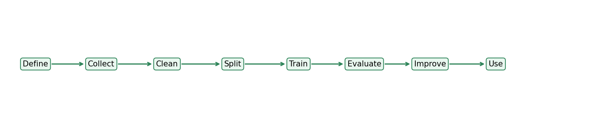

What to notice:
- Training is only one step in a longer process.
- Evaluation and improvement come before real use.

#### 11) Common Beginner Mistakes (Read This Twice)
- Starting with complex models before understanding problem type
- Ignoring data cleaning
- Looking only at one metric (like accuracy)
- Using too little data and expecting perfect results
- Confusing "high score" with "real-world usefulness"

#### 12) Chapter Checkpoint
Can you answer these in your own words?
1. What is ML?
2. Difference between AI and ML?
3. When do we use classification?
4. Why does data quality matter so much?

If yes, move to the next lesson.

If you can answer these confidently, move to the next chapter.

---

## Chapter 2
### Data Basics Without Fear

#### 1) Why This Chapter Matters
Most ML mistakes are not model mistakes. They are data mistakes.

If you understand data structure and data quality, you are already ahead of many beginners.

This chapter is where you build habits that prevent hidden errors later.
Strong data habits make even simple models useful.
Weak data habits can make advanced models fail.

Treat this chapter as your reliability toolkit: if results look strange in future chapters, you will come back here to diagnose the cause.

By the end, you should be able to:
1. Explain rows, columns, features, and labels
2. Describe train, validation, and test splits
3. Recognize common data quality problems
4. Explain why leakage creates fake model success

Pattern reminder:
- Concept
- Why it matters
- Quick exercise
- Visual aid

#### 2) Rows, Columns, Features, and Labels
- Row: one record/example (for example, one customer).
- Column: one property/field (for example, age).
- Feature: an input column the model uses to make predictions.
- Label (target): the output we want to predict.

Label is the target variable that the model predicts based on the provided features.

Example table:
- Features: `hours_studied`, `attendance`
- Label: `passed`

Why it matters:
- If you confuse features and labels, the rest of the ML workflow breaks.
- Correctly separating inputs from outputs is one of the most important beginner habits.

Quick exercise:
- In a house-price dataset, which is the label: `bedrooms` or `price`?

#### 3) Features vs Labels in Plain English
Think of features as clues and labels as answers.

- Features = clues the model can see
- Label = answer the model must learn to predict

If you accidentally include the answer as a feature, your model will look great and fail in real life.

Why it matters:
- This is the easiest place to create leakage without realizing it.
- A model should learn from clues, not secretly see the answer.

Quick exercise:
- Why would including `final_exam_result` as a feature while predicting `passed` be a problem?

#### 4) Train, Validation, and Test Sets
We split data into parts so we can measure real performance.

Why this split is needed:
- The main goal is to estimate how well the model will perform on new, unseen cases, not just on familiar rows.
- If the model is trained and evaluated on the same data, scores can look artificially high.
- Splitting creates a realistic simulation of the real world: first learn, then tune, then prove.

What we are trying to achieve:
1. Learn useful patterns without memorizing noise.
2. Make model choices using fair comparisons.
3. Keep one untouched benchmark for an honest final check.

Mental model:
- Training set = where the model practices by learning patterns from examples.
- This is the only split used to fit model parameters.
- Validation set = where you tune decisions such as model type, hyperparameters, and threshold.
- It helps you compare options without touching the final exam.
- Test set = the final exam you take after all choices are locked.
- It estimates how the model is likely to perform in real-world use.

Wrong vs right order:
1. Wrong: clean everything, tune everything, then split
- This lets information leak across boundaries.
2. Right: split first, then fit preprocessing and tuning logic on training data (and validation folds) only.

1. Training set
- Used to teach the model patterns.

2. Validation set
- Used to tune choices (for example, model settings).

3. Test set
- Used at the end for unbiased final evaluation.

Simple split for beginners:
- 70% train
- 15% validation
- 15% test

If your dataset is very small, use cross-validation later (covered in a future chapter).

Why it matters:
- A model can look good on familiar data and still fail on new data.
- Separate data splits help you measure real-world performance more honestly.

Quick exercise:
- Which set should be saved for the final unbiased performance check: training, validation, or test?

#### 5) Data Quality Basics
##### Missing values
Some cells are empty (`NaN`, blank, null). Options:
- Remove rows (if only a few are missing)
- Fill missing values (mean, median, mode, or domain rule)

##### Outliers
Values far from normal range (for example, salary = 999999999).

Outliers might be:
- Real rare cases
- Data entry errors

Never remove outliers blindly. Investigate first.

##### Duplicate rows
Duplicates can bias learning and metrics. Remove exact duplicates unless duplicates are meaningful for your use case.

##### Inconsistent categories
`"New York"`, `"new york"`, and `"NY"` may mean the same thing. Standardize text categories.

Why it matters:
- Data quality problems quietly damage models before training even starts.
- Beginners often blame the algorithm when the real issue is messy input data.

Quick exercise:
- Name one example of a missing-value strategy and one example of a category-cleaning strategy.

#### 6) Data Leakage
Data leakage means your model accidentally sees future or target information that would not be available in real prediction time.

Concrete mini-story:
- You are predicting loan default.
- You include `days_late_last_month` from a period after the approval decision.
- In training, this feature looks very predictive.
- In real use, that value does not exist yet, so performance collapses.

Common leakage examples:
- Including a post-event field (for example, `loan_default_date`) while predicting loan default.
- Scaling or imputing using the full dataset before train/test split.
- Randomly splitting time-series data where future points leak into training.

Leakage usually gives fake high scores.

Rule: split first, then fit preprocessing only on training data.

Quick safe pipeline:
1. Split data into train/validation/test.
2. Fit imputers/scalers/encoders on train only.
3. Transform validation/test using train-fitted objects.
4. Evaluate once on test after model choices are finalized.

Why it matters:
- Leakage creates false confidence.
- It is one of the biggest reasons beginner projects look impressive in notebooks but fail in real life.

Quick exercise:
- Safe or unsafe: fill missing values using the full dataset before splitting?

#### 7) Hands-On Mini Exercise
Goal: clean a tiny messy dataset.

```python
import pandas as pd

raw = pd.DataFrame({
  "hours_studied": [2, 4, None, 5, 100, 4],
  "attendance": [60, 75, 80, None, 90, 75],
  "city": ["New York", "new york", "NY", "Boston", "Boston", "Boston"],
  "passed": [0, 1, 1, 1, 1, 1],
})

# 1) Remove exact duplicate rows
df = raw.drop_duplicates().copy()

# 2) Fill missing numeric values with median
df["hours_studied"] = df["hours_studied"].fillna(df["hours_studied"].median())
df["attendance"] = df["attendance"].fillna(df["attendance"].median())

# 3) Standardize city names
df["city"] = df["city"].str.strip().str.lower()
df["city"] = df["city"].replace({"ny": "new york"})

# 4) Quick outlier check
print(df.describe(include="all"))
print(df)
```

What to notice:
- Missing values are handled.
- Text categories are normalized.
- Outlier (`hours_studied = 100`) is still present and should be reviewed, not automatically deleted.

#### 8) Data Table Anatomy

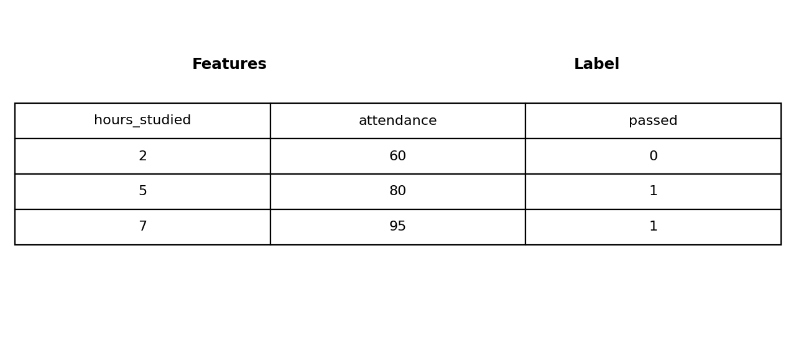

What to notice:
- Rows are examples.
- Columns hold features and labels.
- The label is the answer column, not an input clue.

#### 9) Safe Split vs Leakage Risk

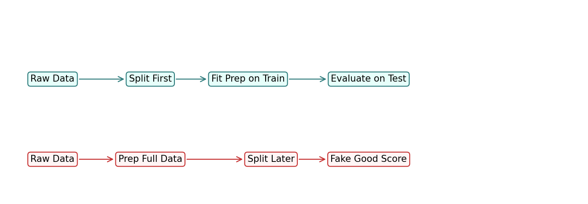

What to notice:
- Splitting first protects the test set.
- Preparing the whole dataset before splitting can leak information.

#### 10) Checklist Before You Train Any Model
1. Is the target column correct?
2. Are there missing values?
3. Any obvious outliers or impossible values?
4. Any duplicates?
5. Any data leakage risk?
6. Did you split data before fitting transforms?

If you can answer all six, you are ready to train.

#### 11) Common Beginner Mistakes in Data Work
- Cleaning the entire dataset before splitting
- Mixing target info into features
- Ignoring units (for example, cm vs inches)
- Encoding categories inconsistently
- Not documenting cleaning decisions

Tip: keep a simple data cleaning log in plain text.

#### 12) Chapter Checkpoint
Answer in your own words:
1. Difference between feature and label?
2. Why do we need train/validation/test split?
3. What is leakage and why is it dangerous?
4. When should you remove outliers, and when should you keep them?

If you can answer these confidently, move to the next chapter.

---

## Chapter 3
### Regression: Predicting Numbers Without Panic

#### 1) What You Will Learn
In this chapter, you will learn how to predict a number using regression.

Think of regression as the simplest way to connect inputs to a numeric outcome.
This chapter shows not just how to fit a model, but how to judge whether its errors are acceptable for a real decision.

Do not rush the metrics section.
Understanding what an error means in business terms is more important than just calculating a metric value.

By the end, you should be able to:
1. Explain regression in plain English
2. Build a simple linear regression model
3. Evaluate results using MAE and RMSE
4. Interpret whether the model is useful

Pattern reminder:
- Concept
- Why it matters
- Quick exercise
- Visual aid

#### 2) What Is Regression?
Regression is used when the output is a number.

Layered view:
- Layer 1 (what): predict a numeric value.
- Layer 2 (why): many business questions are about "how much" or "how long".
- Layer 3 (goal): produce estimates accurate enough to support decisions.

Examples:
- Predict house price
- Predict monthly sales
- Predict delivery time in minutes

Clarification for beginners:
- Predicting a count can still be regression if treated as a numeric target.
- Predicting a label like "high/medium/low" is classification even if labels look ordered.

If your target is numeric and continuous, regression is usually the right starting point.

Why it matters:
- If the target is numeric, regression is often the first sensible baseline.
- Picking the right problem type avoids confusion with the wrong metrics and models.

Quick exercise:
- Is predicting tomorrow's temperature regression or classification?

#### 3) Intuition: The Best-Fit Line
Imagine plotting `house_size` on the x-axis and `house_price` on the y-axis.

Usually, bigger houses cost more. A linear regression model draws a line that best fits the points.

The model learns a relationship like:

`predicted_price = intercept + slope * house_size`

You can read this as:
- `intercept`: baseline value
- `slope`: how much price changes when size increases by 1 unit

Tiny numeric intuition:
- If slope is 0.12 (in thousands), each extra square foot adds about $120.
- If predicted values are consistently below actual values for large homes, the model is underestimating at the high end.

Why it matters:
- The best-fit line is the simplest mental model for understanding how a model links input to output.
- Even when later models become more complex, the idea of learning a relationship still stays the same.

Quick exercise:
- If house size increases and price usually increases too, would you expect a positive slope or a negative slope?

#### 4) Prediction Error in Simple Terms
No model is perfect. So we measure error:

`error = actual_value - predicted_value`

If errors are small, model predictions are closer to reality.

Two beginner-friendly metrics:
- MAE (Mean Absolute Error): average absolute error
- RMSE (Root Mean Squared Error): similar to MAE, but penalizes large mistakes more

Why RMSE reacts more strongly:
- Errors: 2, 3, 20
- MAE = (2 + 3 + 20) / 3 = 8.33
- RMSE = sqrt((4 + 9 + 400) / 3) = 11.73

Same model, same data, but RMSE highlights the large miss more aggressively.

Rule of thumb:
- Lower MAE/RMSE is better
- RMSE is more sensitive to big misses

Why it matters:
- Models are only useful if their mistakes are small enough for the real use case.
- Metrics turn vague impressions like "looks okay" into something measurable.

Quick exercise:
- Which metric usually punishes one very large mistake more: MAE or RMSE?

#### 5) Tiny Regression Example (No Code)
Suppose actual house prices are:
- 200k, 250k, 300k

Model predicts:
- 210k, 245k, 330k

Absolute errors:
- 10k, 5k, 30k

MAE:
- `(10k + 5k + 30k) / 3 = 15k`

Interpretation:
- On average, the model is off by about $15,000.

#### 6) Hands-On Mini Project: House Price Baseline
```python
import pandas as pd
from sklearn.model_selection import train_test_split
from sklearn.linear_model import LinearRegression
from sklearn.metrics import mean_absolute_error, mean_squared_error

# Small synthetic dataset
data = pd.DataFrame({
  "size_sqft": [600, 750, 800, 900, 1100, 1200, 1400, 1600, 1800, 2000],
  "bedrooms":  [1,   1,   2,   2,   2,    3,    3,    3,    4,    4],
  "price":     [150, 180, 200, 220, 260,  280,  320,  360,  390,  430],
})

# Features and target
X = data[["size_sqft", "bedrooms"]]
y = data["price"]

# Split
X_train, X_test, y_train, y_test = train_test_split(
  X, y, test_size=0.2, random_state=42
)

# Train
model = LinearRegression()
model.fit(X_train, y_train)

# Predict
preds = model.predict(X_test)

# Evaluate
mae = mean_absolute_error(y_test, preds)
rmse = mean_squared_error(y_test, preds) ** 0.5

print("MAE:", round(mae, 2))
print("RMSE:", round(rmse, 2))
print("Predictions:", preds)
print("Actual:", y_test.values)
```

Notes:
- The `price` here is in thousands.
- If MAE is 20, average error is about $20,000.

#### 7) Interpreting Results
Ask these questions:
1. Is the error small enough for the business use case?
2. Are predictions consistently too high or too low?
3. Does performance hold on test data (not just training data)?

What "performance" means here:
- It is the quality of model predictions on data the model did not train on.
- We care about this because real users always send new, unseen cases.

Example:
- For luxury housing, a $20k error may be acceptable.
- For low-price rentals, the same error may be too high.

Why it matters:
- A score is never "good" by itself; it is only good or bad relative to the decision you are supporting.
- Beginners often stop at a metric instead of asking whether the metric is good enough for the real task.

Quick exercise:
- Would a $20,000 error feel more acceptable for luxury homes or for low-cost rentals?

#### 8) Common Regression Pitfalls
- Using regression when target is actually a category
- Forgetting train/test split
- Ignoring outliers that dominate model fitting
- Evaluating only on training data
- Interpreting correlation as causation

Important:
Linear regression captures linear patterns. If reality is highly curved or complex, this model can underfit.

#### 9) Quick Upgrade Ideas (Optional)
After baseline linear regression, you can try:
- Add meaningful features (location score, age of house)
- Remove or cap obvious outliers
- Try polynomial features for mild non-linearity
- Compare with tree-based regressor later

Always keep baseline results so improvements are measurable.

#### 10) Regression Scatter + Best-Fit Line

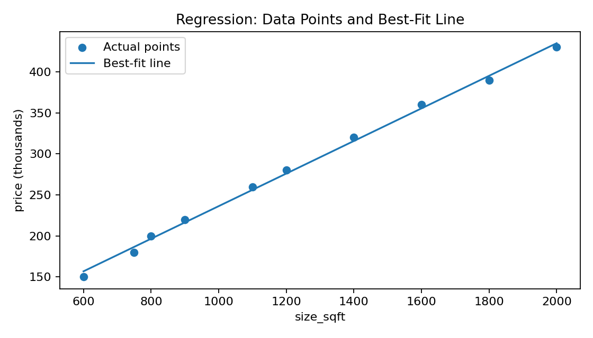

What to notice:
- The line shows the model trend.
- Vertical gap from a point to the line is prediction error.

#### 11) Chapter Checkpoint
Answer in your own words:
1. When should you use regression?
2. Difference between MAE and RMSE?
3. Why do we evaluate on test data?
4. What does it mean if training error is low but test error is high?

If you can answer these confidently, move to the next chapter.

---

## Chapter 4
### Classification: Predicting Categories Clearly

#### 1) What You Will Learn
In this chapter, you will learn how to predict labels (categories) instead of numbers.

Classification is often the first model type used in practical projects such as churn, fraud, and pass/fail prediction.
The key skill here is understanding mistake types, not only overall accuracy.

As you read, keep asking one question:
Which error is more expensive in this use case, a false positive or a false negative?
That question drives good model decisions.

By the end, you should be able to:
1. Explain binary vs multi-class classification
2. Train a simple logistic regression classifier
3. Read a confusion matrix
4. Understand precision, recall, and F1

Pattern reminder:
- Concept
- Why it matters
- Quick exercise
- Visual aid

#### 2) What Is Classification?
Classification is used when the target is a category.

Layered view:
- Layer 1 (what): choose which class an example belongs to.
- Layer 2 (why): many decisions are category decisions (approve/deny, spam/not spam).
- Layer 3 (goal): predict the right class with mistake types we can accept.

Examples:
- Spam vs not spam
- Fraud vs not fraud
- Cat vs dog vs rabbit

If the output is a label, start with classification.

Why it matters:
- If the output is a category, classification is the right family of models and metrics.
- Mixing up classification and regression leads to confusing evaluation and bad decisions.

Quick exercise:
- Is predicting whether a customer will churn a number problem or a category problem?

#### 3) Binary vs Multi-Class
1. Binary classification
- Two possible classes
- Example: pass/fail

2. Multi-class classification
- More than two classes
- Example: predicting flower species (setosa, versicolor, virginica)

The training flow is similar. Only the number of classes changes.

Why it matters:
- This tells you how many outcomes the model must choose from.
- Many real-world beginner projects start with binary classification, so it is worth learning first.

Quick exercise:
- Is classifying an email as spam/not spam binary or multi-class?

#### 4) Logistic Regression in Plain English
Despite the name, logistic regression is a classification model.

It estimates the probability that an example belongs to a class.

Think of it as a score-to-probability converter:
- Inputs create a weighted score.
- The score is mapped to a probability between 0 and 1.
- You then apply a threshold to convert probability into a class label.

Example output:
- `P(spam) = 0.82`

Then we choose a threshold (default often 0.50):
- If probability >= 0.50, predict spam
- Else, predict not spam

Why it matters:
- Thinking in probabilities helps you understand why thresholds matter.
- The model is not only saying yes or no; it is estimating confidence before the final decision rule is applied.

Quick exercise:
- If `P(spam) = 0.82` and the threshold is 0.50, what class will be predicted?

#### 5) Why Accuracy Alone Can Mislead
Imagine 100 emails:
- 95 are not spam
- 5 are spam

A lazy model that always predicts "not spam" gets 95% accuracy, but is useless because it misses all spam.

That is why we also use precision, recall, and F1.

Business lens:
- Fraud detection: missing fraud (false negatives) is expensive.
- Medical screening: missing true cases is risky.
- Marketing targeting: too many false positives wastes budget.

So the "best" metric depends on the cost of each mistake, not just overall percent correct.

Why it matters:
- One metric can hide serious business problems.
- When classes are imbalanced, accuracy can look strong while the model is failing at the task that actually matters.

Quick exercise:
- If a model misses every spam email but still gets 95% accuracy, is that model useful?

#### 6) Confusion Matrix, Precision, Recall, and F1
*Quick note: it is called a "confusion" matrix because it summarizes where the model gets confused between classes.*
*Its most useful part is showing false positives and false negatives clearly.*

What this is trying to achieve:
- Accuracy gives one overall score.
- The confusion matrix shows exactly which error type is happening.
- Precision/recall/F1 help you decide whether the model behavior matches your business risk.

For binary classification:

- True Positive (TP): predicted positive, actually positive
- True Negative (TN): predicted negative, actually negative
- False Positive (FP): predicted positive, actually negative
- False Negative (FN): predicted negative, actually positive

These four values tell you exactly what types of mistakes your model makes.

#### 7) Precision, Recall, F1 in Plain Language
- Precision: Of predicted positives, how many were truly positive?
- Recall: Of actual positives, how many did we catch?
- F1: Balance between precision and recall

Simple formulas:
- Precision = `TP / (TP + FP)`
- Recall = `TP / (TP + FN)`
- F1 = harmonic mean of precision and recall = `2 * (Precision * Recall) / (Precision + Recall)`

Why harmonic mean (and not regular average)?
- It rewards models only when both precision and recall are good.
- If one is high and the other is low, F1 drops a lot.
- So F1 is a strict "balance" score, not a "one metric is enough" score.

Quick intuition:
- Precision = 1.00 and Recall = 0.20
- Regular average would be `(1.00 + 0.20) / 2 = 0.60` (looks okay)
- F1 is `2 * (1.00 * 0.20) / (1.00 + 0.20) = 0.33` (correctly shows poor balance)

Use case intuition:
- Spam filter: high precision avoids flagging good email as spam
- Disease screening: high recall avoids missing sick patients

Why it matters:
- These metrics help you understand not just how often the model is correct, but what kind of mistakes it makes.
- Different applications care about different mistakes.

Quick exercise:
- In disease screening, which usually matters more: high precision or high recall?

#### 8) Hands-On Mini Project: Pass/Fail Classifier
```python
import pandas as pd
from sklearn.model_selection import train_test_split
from sklearn.linear_model import LogisticRegression
from sklearn.metrics import (
  accuracy_score,
  confusion_matrix,
  precision_score,
  recall_score,
  f1_score,
  classification_report,
)

# Tiny synthetic dataset
data = pd.DataFrame({
  "hours_studied": [1, 2, 3, 4, 5, 6, 2, 7, 8, 3, 5, 6],
  "attendance": [45, 55, 60, 70, 75, 80, 50, 88, 92, 65, 78, 85],
  "passed": [0, 0, 0, 1, 1, 1, 0, 1, 1, 0, 1, 1],
})

X = data[["hours_studied", "attendance"]]
y = data["passed"]

X_train, X_test, y_train, y_test = train_test_split(
  X, y, test_size=0.25, random_state=42, stratify=y
)

model = LogisticRegression()
model.fit(X_train, y_train)

preds = model.predict(X_test)

print("Accuracy:", round(accuracy_score(y_test, preds), 3))
print("Confusion Matrix:\n", confusion_matrix(y_test, preds))
print("Precision:", round(precision_score(y_test, preds), 3))
print("Recall:", round(recall_score(y_test, preds), 3))
print("F1:", round(f1_score(y_test, preds), 3))
print("\nClassification Report:\n", classification_report(y_test, preds))
```

What to notice:
- Accuracy is only one metric.
- Confusion matrix shows mistake types.
- Precision and recall explain quality from different angles.

#### 9) Threshold Tuning
The default threshold is often 0.50, but you can change it.

Mini tradeoff example:
- At threshold 0.50, you catch 70 of 100 true positives with 20 false positives.
- At threshold 0.30, you catch 88 of 100 true positives with 45 false positives.

Neither is universally better. Choose based on error costs.

- Lower threshold (for example 0.30): catches more positives (higher recall), but can raise false alarms.
- Higher threshold (for example 0.70): fewer false alarms (higher precision), but may miss positives.

You choose threshold based on business cost of errors.

Why it matters:
- The threshold connects model output to business action.
- Changing it can make the same model behave more cautiously or more aggressively.

Quick exercise:
- If you want to catch more positives even at the cost of more false alarms, should you lower or raise the threshold?

#### 10) Common Classification Pitfalls
- Relying only on accuracy
- Ignoring class imbalance
- Forgetting to use stratified split in small datasets
- Choosing threshold without business context
- Evaluating on training data only

#### 11) Confusion Matrix Heatmap

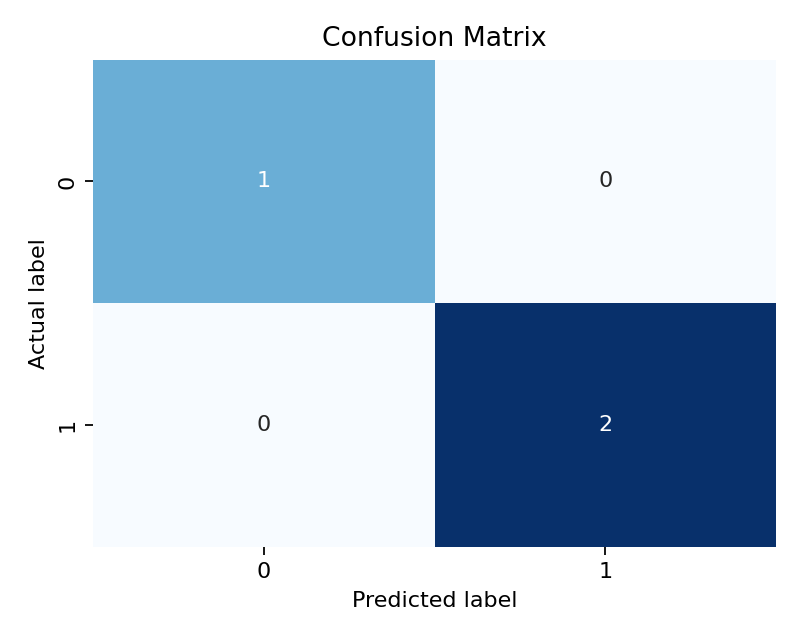

What to notice:
- Diagonal cells are correct predictions.
- Off-diagonal cells are mistake types.

#### 12) Chapter Checkpoint
Answer in your own words:
1. Difference between binary and multi-class classification?
2. Why can accuracy be misleading?
3. What does precision measure?
4. What does recall measure?
5. When would you lower the decision threshold?

If you can answer these confidently, move to the next chapter.

---

## Chapter 5
### Tree Models: Powerful Models You Can Explain

#### 1) What You Will Learn
In this chapter, you will learn how tree-based models make decisions and why they are so popular for tabular data.

Tree models are a great bridge between intuition and performance.
You can inspect their decision paths.
You can explain them to non-technical stakeholders.
You can still get strong baseline results.

Focus on the trade-off between fit and generalization. A model that looks perfect on training data can still fail in real-world use.

By the end, you should be able to:
1. Explain how a decision tree works
2. Recognize overfitting in trees
3. Explain why random forests are usually stronger than one tree
4. Build and compare a tree and a random forest

Pattern reminder:
- Concept
- Why it matters
- Quick exercise
- Visual aid

#### 2) Decision Trees in Plain English
A decision tree is a flowchart of yes/no questions.

Example for churn prediction:
1. Is monthly bill > 80?
2. If yes, is contract type month-to-month?
3. If yes, predict likely churn

Each split tries to separate classes better than before.

Split intuition:
- A good split makes each side more "pure" (more similar labels within each branch).
- The model searches for questions that reduce label mixing as much as possible.

So a split is not random wording; it is a data-driven question chosen to improve class separation.

Why beginners like trees:
- Easy to visualize
- Handles mixed feature types well
- Little preprocessing needed compared with some other models

Why it matters:
- Trees are one of the easiest model types to explain to non-technical people.
- They help beginners connect model behavior to plain-language business rules.

Quick exercise:
- If a tree asks a series of yes/no questions, what everyday object does that structure resemble?

#### 3) Quick Concept Exercise: Read a Tree Rule
Suppose a tree path says:
- `tenure < 6`
- `monthly_bill > 90`
- predict `churn = 1`

Exercise:
- Write this as one plain-English business rule.

Suggested answer:
- New customers with high bills are high churn risk.

#### 4) Overfitting in Trees
A deep tree can memorize training data and perform poorly on new data.

Layered view:
- Layer 1 (what): overfitting means learning noise instead of general pattern.
- Layer 2 (why): very flexible trees can keep splitting until they match training quirks.
- Layer 3 (goal): keep enough complexity to learn signal, but not so much that generalization breaks.

Common warning signs:
- Training accuracy very high
- Test accuracy much lower

How to control overfitting:
- `max_depth`
- `min_samples_split`
- `min_samples_leaf`
- Pruning

Why it matters:
- Trees can become extremely flexible very quickly.
- If you do not control complexity, they can look brilliant on training data and weak on real data.

Quick exercise:
- If train score is much higher than test score, what risk does that suggest?

#### 5) Quick Concept Exercise: Spot Overfitting
Model A:
- Train accuracy: 0.99
- Test accuracy: 0.71

Model B:
- Train accuracy: 0.89
- Test accuracy: 0.86

Exercise:
- Which model generalizes better?

Suggested answer:
- Model B, because train and test scores are closer and test performance is higher.

#### 6) Random Forest Intuition
Random forest builds many trees and combines their votes.

Why it helps:
- One tree can be unstable
- Many diverse trees reduce variance
- Final prediction is more robust

Instability intuition:
- If you retrain one tree with slightly different samples, its top split can change a lot.
- A forest averages many such trees, so single-tree noise has less influence on final predictions.

Simple idea:
- Decision tree = one opinion
- Random forest = committee decision

Why it matters:
- A single tree can change a lot from small data differences.
- A forest is often more reliable because it reduces the influence of one unstable tree.

Quick exercise:
- Which is usually more stable: one tree or a forest of many trees?

#### 7) Quick Concept Exercise: Why Forests Help
Exercise:
- In one sentence, explain why averaging many trees often beats one deep tree.

Suggested answer:
- Averaging many trees reduces the impact of any one tree's mistakes and overfitting.

#### 8) Hands-On Mini Project: Customer Churn Baseline
```python
import pandas as pd
from sklearn.model_selection import train_test_split
from sklearn.tree import DecisionTreeClassifier
from sklearn.ensemble import RandomForestClassifier
from sklearn.metrics import accuracy_score, f1_score, confusion_matrix

# Tiny synthetic churn-like dataset
data = pd.DataFrame({
  "tenure_months": [1, 2, 3, 6, 8, 12, 18, 24, 30, 36, 4, 10, 20, 28, 40],
  "monthly_bill":  [95, 88, 92, 70, 65, 55, 60, 58, 62, 59, 90, 72, 64, 61, 57],
  "support_calls": [5, 4, 4, 2, 1, 1, 2, 1, 1, 0, 5, 2, 1, 1, 0],
  "month_to_month": [1,1,1,1,0,0,0,0,0,0,1,1,0,0,0],
  "churn":         [1,1,1,1,0,0,0,0,0,0,1,0,0,0,0],
})

X = data[["tenure_months", "monthly_bill", "support_calls", "month_to_month"]]
y = data["churn"]

X_train, X_test, y_train, y_test = train_test_split(
  X, y, test_size=0.3, random_state=42, stratify=y
)

# Model 1: Decision Tree
tree = DecisionTreeClassifier(max_depth=3, random_state=42)
tree.fit(X_train, y_train)
tree_preds = tree.predict(X_test)

# Model 2: Random Forest
forest = RandomForestClassifier(
  n_estimators=200,
  max_depth=4,
  random_state=42,
)
forest.fit(X_train, y_train)
forest_preds = forest.predict(X_test)

print("Decision Tree -> Accuracy:", round(accuracy_score(y_test, tree_preds), 3),
    "F1:", round(f1_score(y_test, tree_preds), 3))
print("Decision Tree Confusion Matrix:\n", confusion_matrix(y_test, tree_preds))

print("Random Forest -> Accuracy:", round(accuracy_score(y_test, forest_preds), 3),
    "F1:", round(f1_score(y_test, forest_preds), 3))
print("Random Forest Confusion Matrix:\n", confusion_matrix(y_test, forest_preds))
```

What to notice:
- Compare both Accuracy and F1.
- Look at confusion matrices, not only one score.
- On many datasets, random forest is more stable.

#### 9) Practical Extension Exercise (Recommended)
Try these changes and log results:
1. Increase tree `max_depth` from 3 to 8
2. Reduce forest `n_estimators` from 200 to 50
3. Add or remove one feature

For each change, record:
- Accuracy
- F1
- Whether model seems more overfit or more robust

#### 10) Tree Diagram + Feature Importance

1. Decision tree structure:

2. Random forest feature importance:
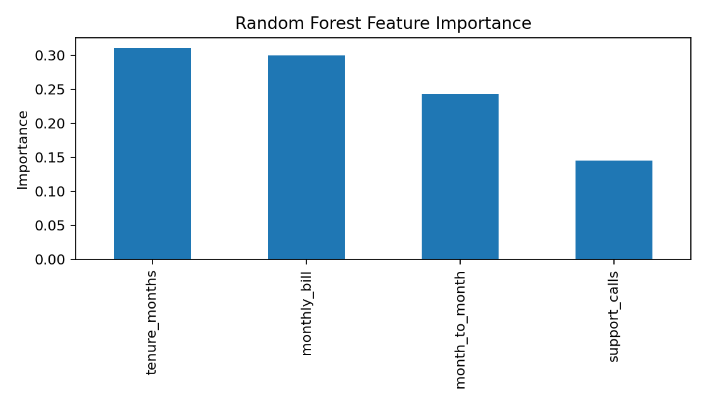

What to notice:
- The tree plot explains model decisions as question paths.
- Feature importance shows which inputs influenced predictions most.

#### 10) Chapter Checkpoint
Answer in your own words:
1. Why are decision trees easy to explain?
2. What is overfitting in a tree model?
3. Why does random forest usually generalize better than one tree?
4. Why should you compare both Accuracy and F1?

If you can answer these confidently, move to the next chapter.

---

## Chapter 6
### Unsupervised Learning: Finding Patterns Without Labels

#### 1) What You Will Learn
In this chapter, you will learn how to group data when no target label is available.

Unsupervised learning can feel abstract at first because there is no answer column to compare against.
This chapter gives you practical anchors so clustering feels like a decision tool, not just a math trick.

The most important outcome here is interpretation: a cluster is only valuable if you can describe it clearly and take action based on it.

By the end, you should be able to:
1. Explain what unsupervised learning is
2. Explain clustering in plain language
3. Use K-means to create segments
4. Interpret clusters in a business-friendly way

Pattern reminder:
- Concept
- Why it matters
- Quick exercise
- Visual aid

#### 2) What Is Unsupervised Learning?
In supervised learning, we have labels.
In unsupervised learning, we do not.

The model tries to discover hidden structure in data.

What "hidden structure" means in practice:
- Examples that behave similarly get grouped together.
- The output is usually group assignments, centers, or lower-dimensional summaries.
- The goal is insight and segmentation, not direct label prediction.

Common unsupervised tasks:
- Clustering (group similar items)
- Dimensionality reduction (compress features while preserving signal)

In this chapter, we focus on clustering.

Why it matters:
- Not all useful business questions come with labeled answers.
- Unsupervised learning helps when you want to discover structure before you even know the right categories.

Quick exercise:
- If your dataset has no target column, is supervised learning always possible?

#### 3) Clustering in Plain English
Clustering groups similar examples together based on feature patterns.

Example:
- Customer A and B buy often and spend a lot -> same cluster
- Customer C buys rarely and spends little -> different cluster

Clusters are discovered by similarity, not by human-provided labels.

Why it matters:
- Clustering can reveal useful business segments that nobody defined in advance.
- It is often used for exploration, prioritization, and strategy rather than direct label prediction.

Quick exercise:
- If two customers behave very similarly, would you expect them in the same cluster or different clusters?

#### 4) Quick Concept Exercise: Is This Clustering?
Scenario:
- You have customer purchase behavior but no "customer type" column.
- You want to discover natural customer groups.

Exercise:
- Is this supervised or unsupervised?

Suggested answer:
- Unsupervised (because there is no target label).

#### 5) K-means Intuition
K-means tries to form `k` groups by minimizing distance from each point to its assigned center (centroid).

Tiny numeric intuition:
- Customer A: spend=200, visits=2
- Customer B: spend=220, visits=3
- Customer C: spend=40, visits=8

Without scaling, spend dominates because 20 dollars difference can outweigh several visit units.
With scaling, both dimensions contribute more fairly to distance.

Simple process:
1. Pick number of clusters `k`
2. Initialize `k` centroids
3. Assign each point to nearest centroid
4. Recompute centroids
5. Repeat until stable

Important beginner note:
- K-means is distance-based, so feature scaling usually matters.

Quick definitions:
- Feature scaling: transforming numeric features to comparable ranges so one large-scale feature does not dominate distance calculations.
- StandardScaler: a common scaling method that converts each feature to roughly mean 0 and standard deviation 1.
- Centroid: the center point of a cluster.
- Distance-based: predictions/grouping depend on how far points are from each other in feature space.

Mini intuition:
- If one feature is in dollars (0-10000) and another is in counts (0-10), unscaled K-means mostly follows dollars.
- Scaling helps each feature contribute more fairly.

Why it matters:
- K-means is one of the most common beginner clustering methods.
- If you understand centroids, distance, and scaling, the algorithm stops feeling mysterious.

Quick exercise:
- Why can one large-scale feature dominate clustering if you do not scale first?

#### 6) Choosing `k` (How Many Clusters?)
There is no perfect universal rule, but beginners can use:

1. Elbow method
- Plot inertia vs `k`
- Look for the bend (where improvement slows)

2. Silhouette score
- Closer to 1 is better separation
- Around 0 means overlap
- Negative suggests poor assignment

Additional definitions:
- Inertia: total within-cluster squared distance; lower means tighter clusters (but it usually decreases as `k` increases).
- Silhouette score: measures how similar a point is to its own cluster compared with other clusters.

Practical beginner workflow:
1. Try `k` from 2 to 8.
2. Plot inertia and inspect the elbow.
3. Compute silhouette for candidate values.
4. Keep only values that produce explainable business segments.
5. Pick the simplest `k` that is both interpretable and reasonably separated.

Use metrics plus domain meaning.

Why it matters:
- You can always make inertia lower by adding more clusters, but that does not always create useful segments.
- Good clustering balances metric quality with human interpretability.

Quick exercise:
- If `k=8` creates clusters nobody can explain, is that automatically a good choice just because a metric improved?

#### 7) Quick Concept Exercise: Picking `k`
Suppose:
- `k=2` merges very different customers
- `k=8` creates tiny hard-to-explain groups

Exercise:
- Which direction is more useful for business storytelling?

Suggested answer:
- Usually a moderate `k` that balances separation and explainability.

#### 8) Hands-On Mini Project: Customer Segmentation with K-means
```python
import pandas as pd
from sklearn.preprocessing import StandardScaler
from sklearn.cluster import KMeans
from sklearn.metrics import silhouette_score

# Tiny synthetic customer behavior dataset
data = pd.DataFrame({
  "monthly_spend": [20, 25, 30, 120, 130, 140, 55, 60, 65, 200, 210, 220],
  "visits_per_month": [1, 1, 2, 8, 9, 9, 4, 5, 4, 12, 13, 12],
  "avg_items_per_order": [1, 2, 2, 6, 7, 6, 3, 3, 4, 9, 10, 9],
})

# Scale features for distance-based clustering
scaler = StandardScaler()
X_scaled = scaler.fit_transform(data)

# Try a few k values
for k in [2, 3, 4]:
  model = KMeans(n_clusters=k, random_state=42, n_init=10)
  labels = model.fit_predict(X_scaled)
  score = silhouette_score(X_scaled, labels)
  print(f"k={k} silhouette={score:.3f}")

# Final model (example: choose k=3)
kmeans = KMeans(n_clusters=3, random_state=42, n_init=10)
data["cluster"] = kmeans.fit_predict(X_scaled)

print("\nCluster counts:")
print(data["cluster"].value_counts().sort_index())

print("\nCluster profile means:")
print(data.groupby("cluster").mean(numeric_only=True))
```

What to notice:
- Scaling is done before K-means.
- You test multiple `k` values.
- You interpret clusters using profile means.

#### 9) Business Interpretation Exercise
After clustering, give each cluster a plain-language name.

Example naming:
- Cluster 0: "Low-frequency, low-spend"
- Cluster 1: "Regular shoppers"
- Cluster 2: "High-value power shoppers"

Exercise:
- Write one action your business would take for each cluster.

#### 10) Common Clustering Pitfalls
- Forgetting feature scaling
- Picking `k` only by metric, ignoring interpretability
- Treating cluster IDs as ranks (Cluster 2 is not "better" than Cluster 1)
- Assuming clusters are permanent truth rather than useful approximations

#### 11) Cluster Scatter + Elbow Plot

1. Customer cluster scatter:
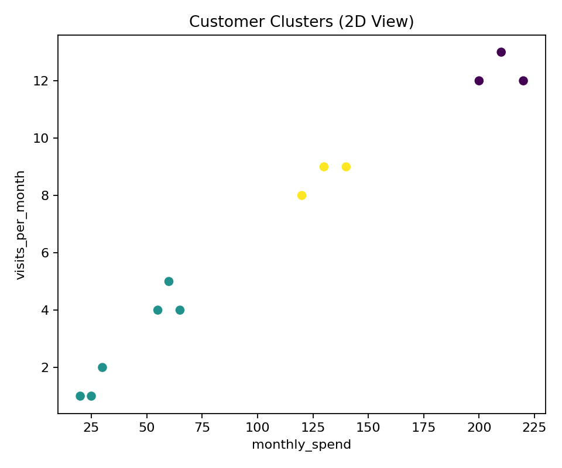
2. Elbow method plot:
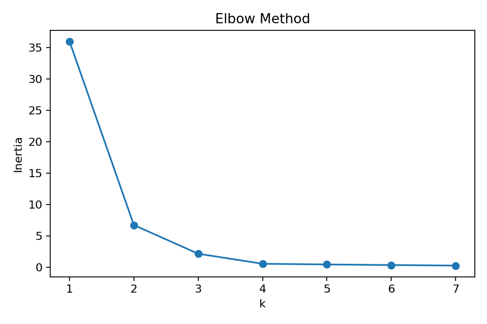

What to notice:
- Cluster scatter helps you see segment separation.
- In the elbow plot, look for where inertia stops dropping sharply.

#### 12) Chapter Checkpoint
Answer in your own words:
1. How is unsupervised learning different from supervised learning?
2. Why do we usually scale data for K-means?
3. What do elbow and silhouette help with?
4. Why must cluster results be interpreted with domain context?

If you can answer these confidently, move to the next chapter.

---

## Chapter 7
### Model Improvement Essentials: From "It Works" to "It Works Reliably"

#### 1) What You Will Learn
In this chapter, you will learn the practical habits that make models more reliable, not just higher-scoring by accident.

This chapter is about disciplined improvement.
The objective is not to chase any higher score.
The objective is to produce improvements you can trust and explain.

Keep a simple experiment log as you read and practice: what changed, why you changed it, and what happened to your metric.

By the end, you should be able to:
1. Explain why feature engineering improves model signal
2. Detect and prevent train/test leakage during improvements
3. Use cross-validation for more stable performance estimates
4. Tune key hyperparameters systematically
5. Improve a baseline model and explain why the improvement is trustworthy

Pattern reminder:
- Concept
- Why it matters
- Quick exercise
- Visual aid

#### 2) Feature Engineering
Feature engineering means creating, transforming, or selecting inputs so the model can learn patterns more clearly.

Layered view:
- Layer 1 (what): improve the input representation.
- Layer 2 (why): raw columns often hide useful relationships.
- Layer 3 (goal): increase signal-to-noise so simpler models can perform better and be easier to explain.

Examples:
- Creating `bill_per_support_call` from two raw columns
- Log-transforming highly skewed spend data
- Dropping noisy or redundant features

Why it matters:
- A simple model with strong features often beats a complex model with weak features.
- It improves both accuracy and interpretability.

Quick exercise:
- From a customer table with `monthly_bill` and `support_calls`, propose two engineered features.
- Explain what behavior each feature might capture.

#### 3) Leakage During Improvement
Leakage is even easier to introduce while tuning and feature engineering.

Common mistakes:
- Scaling or encoding before splitting data
- Building engineered features using future information
- Picking features using full dataset correlations before train/test split

Safe pattern during improvement:
1. Freeze test set first.
2. Build preprocessing + model in one pipeline.
3. Run feature engineering and tuning inside CV on training data only.
4. Touch test set once at the end for final estimate.

Why it matters:
- Leakage can make a weak model look excellent.
- In production, those gains vanish.

Quick exercise:
- Mark each as safe/unsafe:
1. Fit scaler on full dataset, then split
2. Split first, fit scaler on training only
3. Use target-dependent encoding on full data before split

#### 4) Cross-Validation
Cross-validation (CV) evaluates a model across multiple train/validation splits, then averages the scores.

Fold mental model (5-fold example):
- Split training data into 5 parts.
- Train on 4 parts, validate on 1 part.
- Repeat 5 times so each part is validation once.
- Average the 5 validation scores.

This reduces the risk of trusting one lucky split.

Why it matters:
- One random split can be lucky or unlucky.
- CV gives a more stable estimate of real-world performance.

Beginner rule:
- If data is small or medium, use 5-fold CV.

Quick exercise:
- Your model scores 0.91 on one split but CV mean is 0.83. Which number should you trust more for planning?

#### 5) Hyperparameter Tuning
Hyperparameters are model settings you choose before training (for example, tree depth).

Examples:
- Decision tree `max_depth`
- Random forest `n_estimators`
- Logistic regression regularization strength

Beginner strategy:
1. Start with a simple baseline and record metrics.
2. Tune one small parameter grid at a time.
3. Prefer small, explainable improvements over aggressive search.
4. Keep the same metric during comparisons.

Why it matters:
- Good hyperparameters can reduce overfitting and improve generalization.
- Random guessing settings is inefficient; grid/random search is safer.

Quick exercise:
- If train score is very high and validation score is much lower, should you increase or decrease model complexity?

#### 6) Hands-On Mini Project: Improve a Baseline with CV and Tuning
```python
import pandas as pd
from sklearn.model_selection import train_test_split, cross_val_score, GridSearchCV
from sklearn.ensemble import RandomForestClassifier
from sklearn.metrics import accuracy_score, f1_score

# Synthetic churn-style data
data = pd.DataFrame({
  "tenure_months": [1,2,3,6,8,12,18,24,30,36,4,10,20,28,40,5,7,14,22,34],
  "monthly_bill": [95,88,92,70,65,55,60,58,62,59,90,72,64,61,57,85,80,68,63,58],
  "support_calls": [5,4,4,2,1,1,2,1,1,0,5,2,1,1,0,4,3,2,1,1],
  "month_to_month": [1,1,1,1,0,0,0,0,0,0,1,1,0,0,0,1,1,0,0,0],
  "churn": [1,1,1,1,0,0,0,0,0,0,1,0,0,0,0,1,1,0,0,0],
})

X = data[["tenure_months", "monthly_bill", "support_calls", "month_to_month"]]
y = data["churn"]

X_train, X_test, y_train, y_test = train_test_split(
  X, y, test_size=0.3, random_state=42, stratify=y
)

# 1) Baseline model
baseline = RandomForestClassifier(random_state=42)
baseline.fit(X_train, y_train)
base_preds = baseline.predict(X_test)

print("Baseline -> Accuracy:", round(accuracy_score(y_test, base_preds), 3),
    "F1:", round(f1_score(y_test, base_preds), 3))

# 2) Cross-validation estimate on training data
cv_scores = cross_val_score(
  RandomForestClassifier(random_state=42),
  X_train,
  y_train,
  cv=5,
  scoring="f1",
)
print("CV F1 scores:", [round(s, 3) for s in cv_scores])
print("CV mean F1:", round(cv_scores.mean(), 3))

# 3) Hyperparameter tuning
param_grid = {
  "n_estimators": [100, 200, 400],
  "max_depth": [2, 3, 4, None],
  "min_samples_leaf": [1, 2, 3],
}

search = GridSearchCV(
  RandomForestClassifier(random_state=42),
  param_grid=param_grid,
  cv=5,
  scoring="f1",
  n_jobs=-1,
)
search.fit(X_train, y_train)

best_model = search.best_estimator_
best_preds = best_model.predict(X_test)

print("Best params:", search.best_params_)
print("Tuned -> Accuracy:", round(accuracy_score(y_test, best_preds), 3),
    "F1:", round(f1_score(y_test, best_preds), 3))
```

What to notice:
- Improvement should be judged on test performance and CV stability, not one lucky score.
- Best hyperparameters are context-dependent, not universal.

#### 7) Baseline vs Tuned Scores

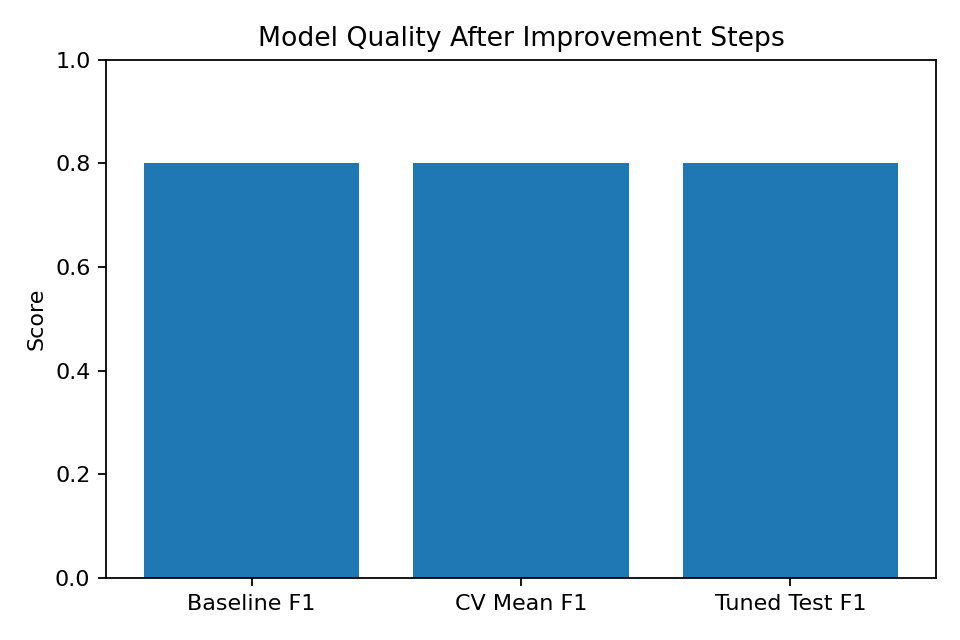

What to notice:
- CV mean helps ground expectations.
- Tuned test score should improve without a large stability drop.

#### 8) Hyperparameter Effect Curve

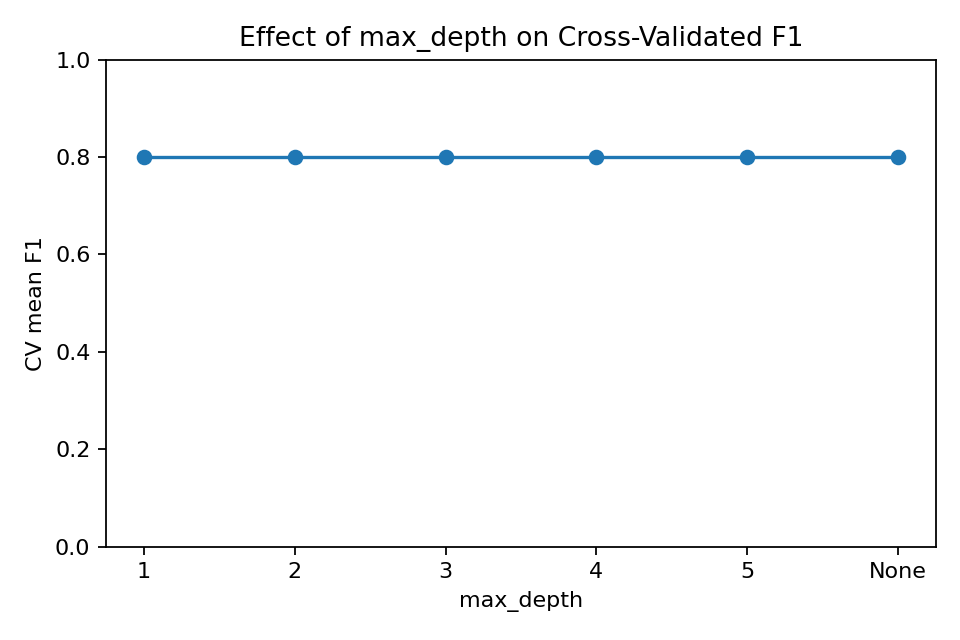

What to notice:
- Performance often improves up to a point, then plateaus or declines.
- This helps choose a complexity level that generalizes better.

#### 9) Practical Improvement Checklist
Before claiming a model improved, confirm:
1. Same evaluation metric as baseline
2. No leakage introduced
3. CV used for stability estimate
4. Test performance improved or stayed stable
5. Improvement is explainable in plain language

#### 10) Chapter Checkpoint
Answer in your own words:
1. Why can better features beat a more complex model?
2. Why is CV more trustworthy than one split?
3. What is one leakage trap during tuning?
4. How do you know tuning really improved your model?

If you can answer these confidently, move to the next chapter.

---

## Chapter 8
### Practical Workflow and Deployment: Making Models Useful in Real Life

#### 1) What You Will Learn
This chapter turns model-building into an end-to-end workflow you can actually run in a project.

Here you move from notebook thinking to system thinking.
A model is only one part of the pipeline.
Packaging, inference, and monitoring are what make it usable over time.

If you have only trained models before, this chapter will show how to make those models operational and maintainable.

By the end, you should be able to:
1. Explain the practical ML workflow from problem to prediction
2. Save and reload a trained model reliably
3. Build a tiny local prediction interface
4. Track model quality over time with simple monitoring

Pattern reminder:
- Concept
- Why it matters
- Quick exercise
- Visual aid

#### 2) End-to-End Workflow
A practical ML workflow is a repeatable sequence:
1. Define business goal and success metric
2. Prepare data and baseline model
3. Evaluate and improve
4. Package model for reuse
5. Serve predictions
6. Monitor quality and retrain when needed

Lifecycle view:
- Day 0: launch baseline with clear metric and rollback option.
- Day 30: check data drift and prediction quality on recent labeled data.
- Day 90: refresh features/model if quality drops or business context changes.

Why it matters:
- A high-scoring notebook is not enough.
- Real value comes from repeatable, maintainable predictions.

Quick exercise:
- Write one sentence for each step above using your own churn or pricing example.

#### 3) Saving and Loading Models
After training, you need to save the model artifact so other scripts/apps can use it.

What problem this solves:
- Without saving, each run retrains a new model and may produce different behavior.
- Saving preserves a known model version so predictions are reproducible and auditable.

Common tools:
- `joblib` for scikit-learn models
- versioned filenames (for example, `churn_model_v1.joblib`)

Why it matters:
- Reproducibility: same model, same behavior.
- Deployment: no retraining required on every run.

Quick exercise:
- Propose a naming rule for model files that includes model type, dataset version, and date.

#### 4) Inference Interface
Inference means using a trained model to predict on new input.

Whose interface is this:
- It is the boundary between your model and the system or person calling it.
- A clear interface defines expected input fields, data types, and output format.
- The goal is predictable, low-error integration.

You can start with:
- Command-line script
- Simple function call
- Tiny local web endpoint later

Why it matters:
- Stakeholders care about predictions, not training code.
- A clean input-output interface reduces integration bugs.

Quick exercise:
- Define an input schema for your model (feature names and types).

#### 5) Monitoring Basics
After deployment, model quality can drift.

What quality means here:
- Prediction quality (for example, F1 or MAE) on recent labeled data.
- Data quality (missing values, ranges, category shifts) before labels arrive.

Why monitor both:
- Data shifts are often an early warning before metric drops become obvious.

Two common drifts:
- Data drift: input distribution changes
- Concept drift: relationship between inputs and target changes

Why it matters:
- A model that was good last month may degrade silently.
- Monitoring catches issues before business impact grows.

Simple beginner monitoring:
- Track weekly accuracy/F1 when true labels arrive
- Track missing-value rate and feature ranges
- Set alert thresholds

Starter monitoring table:
1. Performance: weekly F1 (alert if drop > 10% from baseline)
2. Data quality: missing-rate per key feature (alert if > 2x normal)
3. Input drift: feature mean/range shift (alert if sustained for 2 weeks)

When an alert fires:
1. Confirm data pipeline did not break.
2. Check whether user behavior or environment changed.
3. Re-evaluate model on fresh labeled sample before retraining.

Quick exercise:
- Choose one performance metric and one data-quality metric to monitor weekly.

#### 6) Hands-On Mini Project: Train, Save, Reload, Predict
```python
import joblib
import pandas as pd
from sklearn.model_selection import train_test_split
from sklearn.ensemble import RandomForestClassifier
from sklearn.metrics import accuracy_score, f1_score

# Small synthetic churn dataset
data = pd.DataFrame({
  "tenure_months": [1,2,3,6,8,12,18,24,30,36,4,10,20,28,40,5,7,14,22,34],
  "monthly_bill": [95,88,92,70,65,55,60,58,62,59,90,72,64,61,57,85,80,68,63,58],
  "support_calls": [5,4,4,2,1,1,2,1,1,0,5,2,1,1,0,4,3,2,1,1],
  "month_to_month": [1,1,1,1,0,0,0,0,0,0,1,1,0,0,0,1,1,0,0,0],
  "churn": [1,1,1,1,0,0,0,0,0,0,1,0,0,0,0,1,1,0,0,0],
})

X = data[["tenure_months", "monthly_bill", "support_calls", "month_to_month"]]
y = data["churn"]

X_train, X_test, y_train, y_test = train_test_split(
  X, y, test_size=0.3, random_state=42, stratify=y
)

model = RandomForestClassifier(n_estimators=200, max_depth=4, random_state=42)
model.fit(X_train, y_train)

preds = model.predict(X_test)
print("Test Accuracy:", round(accuracy_score(y_test, preds), 3))
print("Test F1:", round(f1_score(y_test, preds), 3))

# Save model
model_path = "churn_model_v1.joblib"
joblib.dump(model, model_path)
print("Saved model to:", model_path)

# Reload model and predict new records
loaded_model = joblib.load(model_path)

new_customers = pd.DataFrame({
  "tenure_months": [2, 26],
  "monthly_bill": [98, 60],
  "support_calls": [4, 1],
  "month_to_month": [1, 0],
})

new_preds = loaded_model.predict(new_customers)
print("New predictions:", new_preds)
```

What to notice:
- Save/load keeps model behavior reproducible.
- Inference works on new rows as long as schema matches training features.

#### 7) Workflow Map

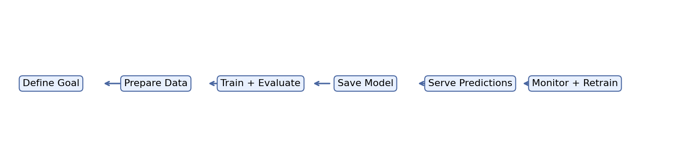

What to notice:
- Deployment is not the end; monitoring closes the loop.
- Workflow is cyclical, not one-and-done.

#### 8) Monitoring Trend Over Time

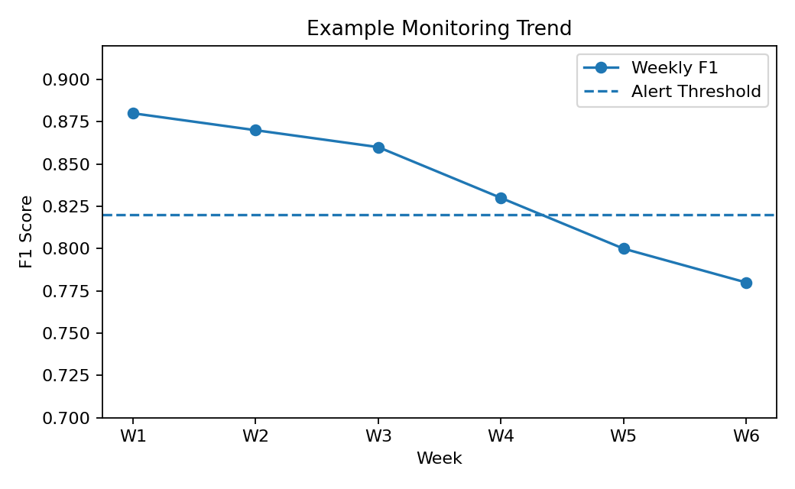

What to notice:
- Quality trend can decline gradually.
- Thresholds help trigger retraining or investigation early.

#### 9) Deployment Readiness Checklist
Before deployment, confirm:
1. Input schema documented
2. Model artifact versioned and saved
3. Offline test metrics acceptable
4. Basic monitoring plan defined
5. Rollback plan exists (previous model available)

#### 10) Chapter Checkpoint
Answer in your own words:
1. Why is model saving important for production reliability?
2. What is the difference between training and inference?
3. What is one sign of model drift?
4. Why should monitoring be planned before deployment?

If you can answer these confidently, move to the next chapter.

---

## Chapter 9
### Responsible and Real-World ML: Building Models You Can Trust

#### 1) What You Will Learn
This chapter focuses on the real-world responsibility side of ML: fairness, explainability, privacy, and practical decision-making.

Technical quality alone is not enough. Real ML work requires reasoning about impact, trust, and safety alongside performance.

Read this chapter with real users in mind: who could be harmed by mistakes, who needs explanations, and what data practices are acceptable.

By the end, you should be able to:
1. Explain why fairness matters in ML systems
2. Explain a model decision using simple interpretability tools
3. Identify basic privacy and safety practices for ML data
4. Use a checklist to decide whether ML is the right solution

Pattern reminder:
- Concept
- Why it matters
- Quick exercise
- Visual aid

#### 2) Fairness in ML
Fairness means model behavior should not systematically disadvantage specific groups.

What "disadvantage" means concretely:
- One group consistently gets worse outcomes (lower approval rate, lower recall, higher false positives) without justified reason.
- The goal is not identical outcomes in every context, but transparent, defensible, and monitored model behavior.

Examples of risk:
- Loan approvals less favorable for one demographic group
- Hiring model filtering one group more aggressively

Important nuance:
- Fairness is measured through multiple metrics (for example, selection rate, recall, false positive rate).
- Improving one fairness metric can sometimes worsen another, so teams must choose trade-offs explicitly.

Why it matters:
- Ethical impact on people
- Legal/compliance risk
- Business trust and reputation risk

Quick exercise:
- Name one dataset feature that could introduce fairness risk and one way to audit it.

#### 3) Explainability
Explainability means we can communicate why the model made a prediction.

Beginner-friendly methods:
- Feature importance (global: what matters overall)
- Local explanation (case-level: why this specific prediction)

Key distinction:
- Explainability answers "why did the model predict this?"
- Fairness answers "are outcomes equitable across groups?"

A model can be explainable and still unfair, so both checks are needed.

Why it matters:
- Users and stakeholders need reasons, not just scores.
- Easier debugging and safer decision review.

Quick exercise:
- For churn prediction, write one plausible explanation sentence for a high-risk customer.

#### 4) Privacy and Safe Data Use
Privacy means protecting personal/sensitive information throughout the ML lifecycle.

Basic practices:
- Data minimization (collect only what is needed)
- Mask or remove direct identifiers where possible
- Access control and audit logs
- Retention limits

Operational example:
1. Keep modeling table with hashed IDs only.
2. Store raw identifiers in a separate restricted system.
3. Delete or archive stale training extracts on a fixed schedule.

Why it matters:
- Reduces harm from data misuse or leaks
- Supports compliance and user trust

Quick exercise:
- Which is safer for modeling: raw full name or hashed customer ID? Why?

#### 5) Should We Even Use ML?
Not every problem needs ML.

Use ML when:
- Pattern is complex and data is available
- You need predictions that adapt over time

Use rules/heuristics when:
- Logic is simple and stable
- Explainability must be absolute and immediate

Decision shortcut:
1. If simple rules already achieve acceptable quality, keep rules.
2. If patterns are complex and changing, ML is usually more suitable.
3. If stakes are high, require both performance evidence and governance before launch.

Why it matters:
- Avoids unnecessary complexity and maintenance cost

Quick exercise:
- Give one business problem better solved with rules, and one better solved with ML.

#### 6) Hands-On Mini Exercise: Group-Level Fairness Snapshot
```python
import pandas as pd

# Tiny example prediction outcomes with a protected group column
data = pd.DataFrame({
  "group": ["A", "A", "A", "A", "B", "B", "B", "B"],
  "actual": [1, 1, 0, 0, 1, 1, 0, 0],
  "pred":   [1, 0, 0, 0, 1, 1, 1, 0],
})

def group_metrics(df):
  # Positive prediction rate and recall by group
  pos_rate = (df["pred"] == 1).mean()
  recall = ((df["pred"] == 1) & (df["actual"] == 1)).sum() / max((df["actual"] == 1).sum(), 1)
  return pd.Series({"positive_prediction_rate": pos_rate, "recall": recall})

summary = data.groupby("group").apply(group_metrics)
print(summary)

print("\nGap checks:")
print("Positive prediction rate gap:", round(abs(summary.loc["A", "positive_prediction_rate"] - summary.loc["B", "positive_prediction_rate"]), 3))
print("Recall gap:", round(abs(summary.loc["A", "recall"] - summary.loc["B", "recall"]), 3))
```

What to notice:
- You can compare metrics across groups as a first fairness check.
- A gap does not automatically prove bias, but it is a signal to investigate.

#### 7) Group Fairness Comparison Chart

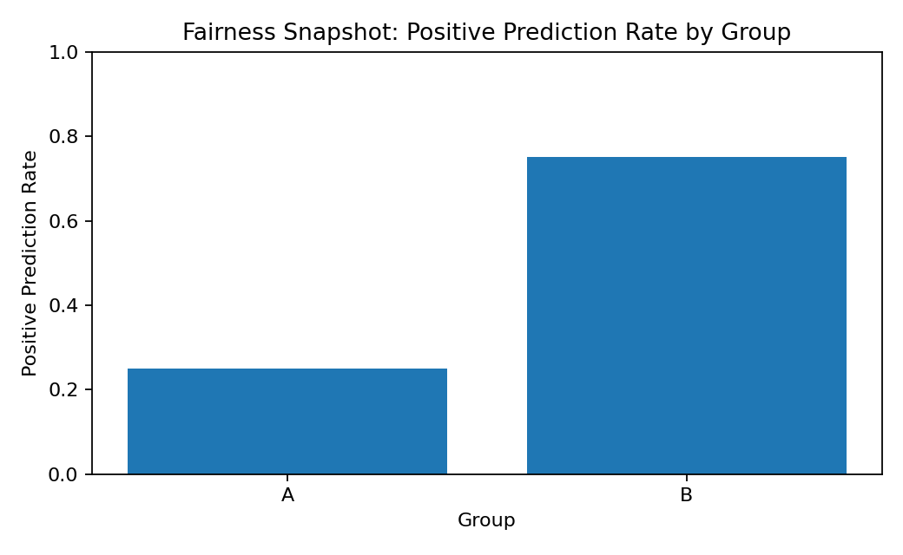

What to notice:
- Visible group gaps are a trigger for deeper review.

#### 8) Explainability Example (Feature Importance)

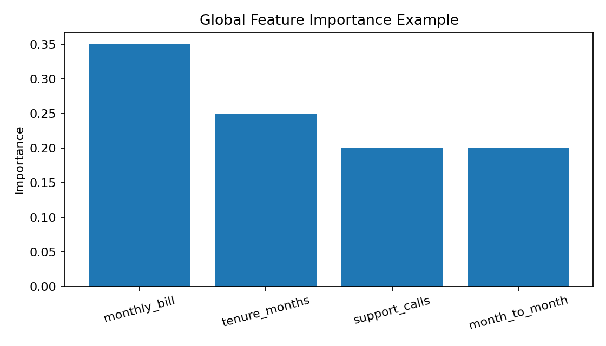

What to notice:
- The chart communicates which features influence predictions most overall.
- This supports transparent stakeholder discussions.

#### 9) Responsible ML Checklist
Before launch, confirm:
1. Group-level metric checks completed
2. Explanation method documented
3. Sensitive data handling reviewed
4. Human override or escalation path defined
5. Monitoring for fairness/performance drift planned

#### 10) Chapter Checkpoint
Answer in your own words:
1. Why is fairness not optional in applied ML?
2. How does explainability help in debugging and trust?
3. What is one practical privacy safeguard?
4. When is a rule-based solution better than ML?

If you can answer these confidently, move to the next chapter.

---

## Chapter 10
### Capstone Project: Putting Everything Together

#### 1) What You Will Learn
This capstone turns all previous chapters into one complete beginner portfolio project.

Think of this chapter as your transition from learning concepts to demonstrating capability.
The goal is not a perfect model.
The goal is a coherent, trustworthy project story from problem definition to conclusion.

Keep scope intentionally small and evidence clear.
Reviewers are usually more impressed by disciplined execution than by unnecessary complexity.

By the end, you should be able to:
1. Choose a realistic domain problem and define it clearly
2. Build a baseline model with a clean train/test workflow
3. Evaluate, improve, and explain model behavior
4. Write a simple final report and presentation summary

Pattern reminder:
- Concept
- Why it matters
- Quick exercise
- Visual aid

#### 2) Pick a Domain and Scope
Choose one domain:
- Health
- Finance
- Education
- Retail

Then define one specific prediction problem.

Scaffolding approach for scope:
1. Start broad: choose a domain you can explain.
2. Narrow to one decision: what action will the prediction support?
3. Lock one measurable target and one metric.

This layering prevents projects from becoming too vague to execute.

Examples:
- Health: predict patient no-show risk
- Finance: predict late-payment risk
- Education: predict course completion risk
- Retail: predict customer churn

Scope guardrails for beginners:
- One target variable only.
- One dataset only.
- One baseline model first.
- One primary metric for decision-making.

Why it matters:
- Good projects start with clear scope.
- If the problem is vague, model choices and metrics become confusing.

Quick exercise:
- Write your domain, target variable, and one sentence describing who will use the prediction.

#### 3) Define the Problem Statement
Use this template:

"We want to predict [target] for [entity] using [available features], so that [decision/action] can be improved."

Add:
1. Prediction type (regression or classification)
2. Primary metric (for example, F1, RMSE)
3. Success threshold (for example, "F1 >= 0.80")

Quality check for this statement:
- Can a non-technical stakeholder understand the action tied to predictions?
- Can you verify success with one metric and one threshold?
- Is the target available at prediction time (no leakage)?

Why it matters:
- A clear problem statement prevents random experimentation.
- It aligns technical work with a real decision.

Quick exercise:
- Write your one-sentence problem statement and success metric.

#### 4) Data and Baseline Plan
Before modeling, define:
1. Data source and columns
2. Feature list and target column
3. Train/test split strategy
4. Baseline model to beat

Minimum evidence checklist:
1. Row count and time coverage documented.
2. Missing-value and class-balance snapshot recorded.
3. Baseline metric on held-out test set captured.
4. One known limitation written explicitly.

Why it matters:
- Baselines make improvement measurable.
- Without a baseline, you cannot prove value.

Quick exercise:
- List three candidate features and explain why each could help prediction.

#### 5) Improvement and Reliability Plan
After baseline, apply one or two improvements only:
- Better feature engineering
- Hyperparameter tuning
- Better threshold choice (for classification)

Then validate with:
- Cross-validation
- Test-set performance
- Basic error analysis

Credible improvement rule:
- Report baseline and improved metrics side by side.
- Explain exactly what changed.
- Keep split and metric consistent.
- Prefer small reliable gains over large unrepeatable gains.

Why it matters:
- Capstone quality is about trustworthy improvement, not complexity.
- Controlled changes make your conclusions credible.

Quick exercise:
- Choose one planned improvement and write what result would count as a real win.

#### 6) Hands-On Capstone Template (End-to-End)
```python
import pandas as pd
from sklearn.model_selection import train_test_split, cross_val_score, GridSearchCV
from sklearn.ensemble import RandomForestClassifier
from sklearn.metrics import accuracy_score, f1_score, confusion_matrix, classification_report

# 1) Example capstone dataset (replace with your own)
data = pd.DataFrame({
  "tenure_months": [1,2,3,6,8,12,18,24,30,36,4,10,20,28,40,5,7,14,22,34],
  "monthly_bill": [95,88,92,70,65,55,60,58,62,59,90,72,64,61,57,85,80,68,63,58],
  "support_calls": [5,4,4,2,1,1,2,1,1,0,5,2,1,1,0,4,3,2,1,1],
  "month_to_month": [1,1,1,1,0,0,0,0,0,0,1,1,0,0,0,1,1,0,0,0],
  "churn": [1,1,1,1,0,0,0,0,0,0,1,0,0,0,0,1,1,0,0,0],
})

# 2) Problem definition
target_col = "churn"
feature_cols = ["tenure_months", "monthly_bill", "support_calls", "month_to_month"]

X = data[feature_cols]
y = data[target_col]

X_train, X_test, y_train, y_test = train_test_split(
  X, y, test_size=0.3, random_state=42, stratify=y
)

# 3) Baseline model
baseline = RandomForestClassifier(random_state=42)
baseline.fit(X_train, y_train)
base_preds = baseline.predict(X_test)

base_acc = accuracy_score(y_test, base_preds)
base_f1 = f1_score(y_test, base_preds)

print("Baseline Accuracy:", round(base_acc, 3))
print("Baseline F1:", round(base_f1, 3))

# 4) Stability check with CV
cv_scores = cross_val_score(
  RandomForestClassifier(random_state=42),
  X_train,
  y_train,
  cv=5,
  scoring="f1",
)
print("CV F1 scores:", [round(s, 3) for s in cv_scores])
print("CV mean F1:", round(cv_scores.mean(), 3))

# 5) One controlled improvement: tuning
param_grid = {
  "n_estimators": [100, 200, 400],
  "max_depth": [2, 3, 4, None],
  "min_samples_leaf": [1, 2, 3],
}

search = GridSearchCV(
  RandomForestClassifier(random_state=42),
  param_grid=param_grid,
  cv=5,
  scoring="f1",
  n_jobs=-1,
)
search.fit(X_train, y_train)

best_model = search.best_estimator_
tuned_preds = best_model.predict(X_test)

tuned_acc = accuracy_score(y_test, tuned_preds)
tuned_f1 = f1_score(y_test, tuned_preds)

print("Best params:", search.best_params_)
print("Tuned Accuracy:", round(tuned_acc, 3))
print("Tuned F1:", round(tuned_f1, 3))
print("Confusion Matrix:\n", confusion_matrix(y_test, tuned_preds))
print("\nClassification Report:\n", classification_report(y_test, tuned_preds))
```

What to notice:
- You define the problem before coding.
- You keep a baseline and compare improvements against it.
- You use both CV and test metrics before making claims.

#### 7) Capstone Lifecycle Roadmap

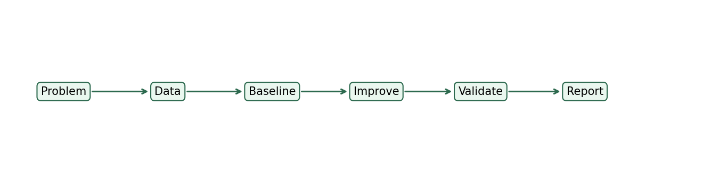

What to notice:
- The capstone is a workflow, not just one training script.
- Report and communication are core technical deliverables.

#### 8) Baseline vs Tuned Capstone Results

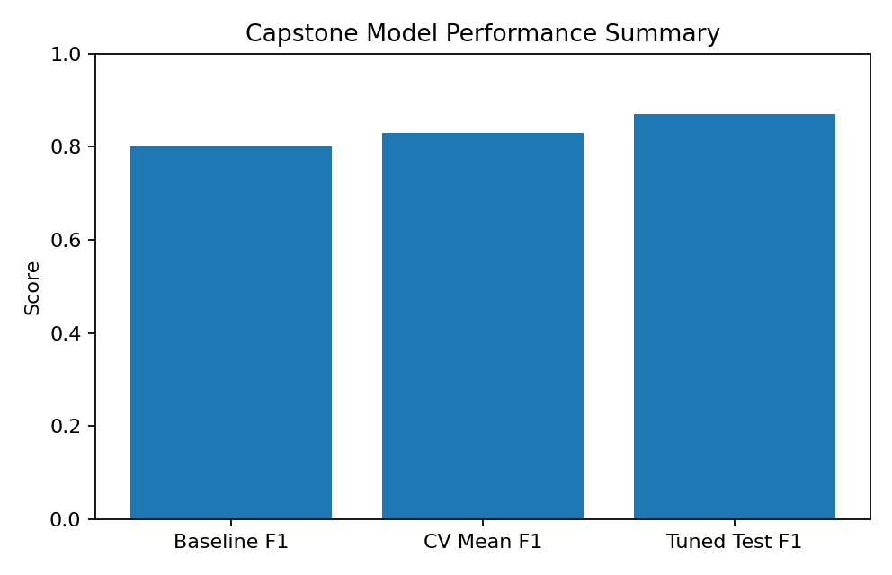

What to notice:
- You compare baseline, CV expectation, and tuned test quality together.
- This prevents over-claiming from one lucky number.

#### 9) Final Presentation Template (Portfolio-Ready)
Use this structure for your final report or slide deck:

1. Problem and business goal
2. Dataset summary and feature list
3. Baseline model and initial metrics
4. Improvement strategy and why chosen
5. Final metrics (test + CV summary)
6. Error analysis and limitations
7. Responsible ML checks (fairness/privacy)
8. Recommended next actions

Tip:
- Keep each section concise and decision-focused.

#### 10) Capstone Completion Checklist
Before you declare the project done, confirm:
1. Problem statement is clear and measurable
2. Baseline and improved model are both reported
3. No leakage in preprocessing or tuning
4. Test-set and CV evidence are included
5. Responsible ML considerations are documented
6. Final summary can be understood by a non-technical stakeholder

If all six are true, your capstone is portfolio-ready.

---

## Appendices
1. Zero-math quick primer (mean, variance, slope, probability)
2. Beginner glossary (one-line definitions)
3. Troubleshooting guide
4. Practice datasets list
5. 30-day and 8-week study plans
6. Machine Learning Pipeline Libraries

---

## Appendix 1: Zero-Math Quick Primer

This appendix gives you the minimum math intuition needed to read the manual without panic.

### 1) Mean
The mean is the average.

Example:
- Numbers: 2, 4, 6
- Mean = `(2 + 4 + 6) / 3 = 4`

Why it matters in ML:
- Means help summarize features.
- Some preprocessing methods center data around the mean.

### 2) Variance
Variance describes how spread out numbers are.

Simple intuition:
- Low variance = values are close together
- High variance = values are more spread out

Why it matters in ML:
- High spread can indicate useful signal or noisy data.
- Standardization uses variance-related information.

### 3) Standard Deviation
Standard deviation is another way to describe spread, in the same unit as the original data.

Simple intuition:
- Easier to read than variance because it stays in the original scale.

Why it matters in ML:
- StandardScaler uses standard deviation.
- Outlier checks often rely on unusual distance from the mean.

### 4) Slope
Slope describes how much one variable changes when another variable changes.

In linear regression:
- A positive slope means the prediction increases as the feature increases.
- A negative slope means the prediction decreases as the feature increases.

Example:
- If slope = 5, then increasing a feature by 1 unit increases the prediction by about 5 units.

### 5) Probability
Probability is how likely something is, usually between 0 and 1.

Examples:
- 0.10 = 10% chance
- 0.80 = 80% chance

Why it matters in ML:
- Classification models often output probabilities before converting them into class labels.
- Thresholds decide when a probability is high enough to call something positive.

### 6) Error
Error is the gap between the actual value and the prediction.

For regression:
- `error = actual - predicted`

Why it matters in ML:
- Metrics like MAE and RMSE summarize prediction error.

### 7) Distance
Distance is a measure of how far two data points are from each other.

Why it matters in ML:
- K-means clustering and some other algorithms depend heavily on distance.
- Feature scaling matters because large-scale variables can dominate distance.

### 8) Correlation
Correlation describes whether two variables tend to move together.

Simple intuition:
- Positive correlation: both tend to rise together
- Negative correlation: one rises while the other falls
- Near zero correlation: little linear relationship

Important warning:
- Correlation does not prove causation.

### 9) Overfitting vs Underfitting
- Overfitting: model memorizes training data and performs poorly on new data
- Underfitting: model is too simple to learn the real pattern

Quick memory trick:
- Overfitting = too specific
- Underfitting = too simple

### 10) The Minimum Takeaway
If you remember only five ideas, remember these:
1. Mean = average
2. Variance/standard deviation = spread
3. Slope = direction and strength of change
4. Probability = confidence-like likelihood
5. Error = how wrong a prediction was

---

## Appendix 2: Beginner Glossary

### Core ML Terms
- Algorithm: the learning method used to find patterns in data.
- Baseline model: a simple first model used as a starting point for comparison.
- Bias: a systematic error or unfair pattern in model behavior.
- Classification: predicting a category or label.
- Cluster: a group of similar examples found in unlabeled data.
- Cross-validation: evaluating a model across multiple train/validation splits.
- Data leakage: accidental use of information that would not be available at prediction time.
- Dataset: a collection of examples used for analysis or training.
- Drift: performance or data behavior changing over time after deployment.
- Feature: an input variable used by the model.
- Feature engineering: creating or transforming inputs to help learning.
- F1 score: a balance score combining precision and recall.
- False negative: an actual positive predicted as negative.
- False positive: an actual negative predicted as positive.
- Hyperparameter: a model setting chosen before training.
- Inference: using a trained model to predict on new data.
- Inertia: the within-cluster distance summary used in K-means.
- Label: the target/output the model tries to predict.
- MAE: mean absolute error, the average absolute prediction error.
- Metric: a measurement used to judge model performance.
- Model: the learned pattern produced by an algorithm.
- Overfitting: learning training data too specifically and failing on new data.
- Precision: of predicted positives, how many were truly positive.
- Probability: a value between 0 and 1 representing likelihood.
- Recall: of actual positives, how many the model correctly found.
- Regression: predicting a numeric value.
- RMSE: root mean squared error, a metric that penalizes large mistakes more than MAE.
- Scaling: transforming features to comparable numeric ranges.
- Silhouette score: a clustering metric showing how well points fit their assigned cluster.
- Target: another name for the label or output column.
- Test set: held-out data used for final unbiased evaluation.
- Threshold: the cutoff used to convert a probability into a class prediction.
- Train set: the data used to fit the model.
- Underfitting: failing to learn enough signal from the data.
- Validation set: data used to compare settings or tune a model during development.

### Quick Language Translation
- "The model learned a pattern" = it found statistical relationships in the training examples.
- "Generalization" = how well the model works on new unseen data.
- "Production" = the real environment where the model is actually used.

---

## Appendix 3: Troubleshooting Guide

Use this appendix when your code runs, but results look confusing or wrong.

### 1) Problem: My model score is surprisingly high
Possible causes:
- Data leakage
- Target accidentally included in features
- Duplicates across train and test

What to check:
1. Did you split before scaling, imputing, or feature engineering?
2. Is the target column excluded from `X`?
3. Are train and test really separate?

### 2) Problem: Training score is high, test score is low
Likely issue:
- Overfitting

What to try:
1. Reduce model complexity
2. Add cross-validation
3. Simplify features
4. Collect more data if possible

### 3) Problem: Model score is low everywhere
Possible causes:
- Weak features
- Wrong model type
- Noisy labels
- Poor data quality

What to try:
1. Re-check whether the problem is regression, classification, or clustering
2. Improve feature quality
3. Clean missing values and inconsistent categories
4. Compare with a simple baseline

### 4) Problem: Accuracy looks good, but the model is useless
Likely cause:
- Class imbalance

What to do:
1. Check precision, recall, and F1
2. Look at the confusion matrix
3. Use stratified splitting for classification

### 5) Problem: K-means gives weird clusters
Possible causes:
- Features not scaled
- Wrong `k`
- Irrelevant features

What to try:
1. Scale numeric features first
2. Compare multiple `k` values
3. Review cluster profiles for interpretability

### 6) Problem: The model fails on new input rows
Possible causes:
- Input columns do not match training schema
- Missing values not handled
- Category formats changed

What to check:
1. Same column names and order?
2. Same preprocessing steps applied?
3. Same units and category formatting?

### 7) Problem: My notebook or script throws import errors
Examples:
- `ModuleNotFoundError: No module named 'pandas'`
- `No module named 'sklearn'`

What to do:
1. Confirm the correct Python environment is active
2. Install the missing package
3. Re-run the script in the same environment

### 8) Problem: I do not know what to improve next
Use this order:
1. Verify data quality
2. Verify leakage is not present
3. Compare with a baseline
4. Add one improvement at a time
5. Re-measure on validation/test data

### 9) Debugging Rule for Beginners
Change one thing at a time.

If you change model, features, metric, and split all at once, you will not know what caused the result.

---

## Appendix 4: Practice Datasets List

These are beginner-friendly dataset ideas you can use for practice.

### 1) Classification Practice
1. Student pass/fail
- Features: hours studied, attendance, homework completion
- Target: passed

2. Customer churn
- Features: tenure, monthly bill, support calls, contract type
- Target: churn

3. Spam detection
- Features: email length, number of links, keyword counts
- Target: spam

### 2) Regression Practice
1. House price prediction
- Features: size, bedrooms, age, location score
- Target: price

2. Delivery time prediction
- Features: distance, traffic level, order size
- Target: delivery time

3. Monthly sales forecasting (basic tabular version)
- Features: marketing spend, season, discount rate
- Target: monthly sales

### 3) Clustering Practice
1. Customer segmentation
- Features: monthly spend, visits per month, average items per order
- Goal: discover natural customer groups

2. Student learning patterns
- Features: study hours, quiz attempts, login frequency
- Goal: discover learner behavior groups

3. App usage segments
- Features: sessions per week, average session length, feature usage count
- Goal: find product usage segments

### 4) Public Dataset Sources to Explore
Use trusted sources when possible:
1. Kaggle datasets
2. UCI Machine Learning Repository
3. Scikit-learn built-in toy datasets
4. Data.gov and similar public data portals

### 5) Recommended Beginner Order
1. Start with a tiny synthetic dataset
2. Move to a clean public dataset
3. Then try a slightly messy real-world dataset

This order reduces frustration while still building practical skill.

---

## Appendix 5: 30-Day and 8-Week Study Plans

Use one of these schedules depending on your pace.

### Plan A: 30-Day Fast Track

#### Week 1
Day 1: Read How To Use This Manual and Chapter 1
Day 2: Re-read Chapter 1 and do the tiny code demo
Day 3: Study Chapter 2 vocabulary and data quality basics
Day 4: Run the Chapter 2 mini exercise
Day 5: Study Chapter 3 concepts and metrics
Day 6: Run the Chapter 3 mini project
Day 7: Review Chapters 1 to 3 and write a one-page summary

#### Week 2
Day 8: Study Chapter 4 classification concepts
Day 9: Run the Chapter 4 classifier example
Day 10: Review confusion matrix, precision, recall, and F1
Day 11: Study Chapter 5 tree models
Day 12: Run the Chapter 5 project and compare tree vs forest
Day 13: Review overfitting and model comparison notes
Day 14: Write your own explanation of when to use regression vs classification

#### Week 3
Day 15: Study Chapter 6 clustering concepts
Day 16: Run the Chapter 6 K-means lab
Day 17: Practice naming clusters in plain language
Day 18: Study Chapter 7 improvement workflow
Day 19: Run the Chapter 7 tuning example
Day 20: Review leakage and cross-validation
Day 21: Summarize Chapters 4 to 7 in your own words

#### Week 4
Day 22: Study Chapter 8 deployment workflow
Day 23: Run save/load model example
Day 24: Study Chapter 9 responsible ML concepts
Day 25: Write fairness and privacy notes for one sample project
Day 26: Study Chapter 10 capstone structure
Day 27: Choose your own capstone problem
Day 28: Build your baseline capstone model
Day 29: Improve and evaluate the capstone
Day 30: Write final capstone summary or presentation slides

### Plan B: 8-Week Standard Track

#### Week 1
- Chapter 1 and Chapter 2
- Goal: understand problem types, features, labels, and data quality

#### Week 2
- Finish Chapter 2 exercises and complete Chapter 3
- Goal: understand regression and numeric prediction

#### Week 3
- Complete Chapter 4
- Goal: understand classification metrics and thresholds

#### Week 4
- Complete Chapter 5
- Goal: understand trees, forests, and overfitting

#### Week 5
- Complete Chapter 6
- Goal: understand clustering and feature scaling

#### Week 6
- Complete Chapter 7
- Goal: learn tuning, leakage prevention, and cross-validation

#### Week 7
- Complete Chapter 8 and Chapter 9
- Goal: connect ML to deployment, monitoring, fairness, and privacy

#### Week 8
- Complete Chapter 10 capstone
- Goal: produce one end-to-end beginner portfolio project

### Recommended Weekly Habit
Each week:
1. Read the concept sections slowly
2. Run at least one code example
3. Write one plain-English summary from memory
4. Answer checkpoint questions without looking back immediately

### If You Fall Behind
Use this recovery rule:
- Do not restart from zero.
- Resume from the current chapter and do a short recap only for the previous one.

Consistency beats intensity.

---

## Appendix 6: Machine Learning Pipeline Libraries

# Machine Learning Pipeline Libraries

## 1. Data Collection & Ingestion

| Library | Module / Class | Purpose | Use Case |
|---|---|---|---|
| **pandas** | `pd.read_*` | Load structured data from CSV, SQL, JSON, Excel | Reading a CSV of customer transactions into a DataFrame for analysis |
| **sqlalchemy** | `sqlalchemy.create_engine` | Connect to and extract from SQL databases | Pulling user records from a PostgreSQL database into a pipeline |
| **beautifulsoup4** | `bs4.BeautifulSoup` | Parse HTML to scrape raw unstructured data | Scraping product names and prices from an e-commerce website |

---

## 2. Data Cleaning & Preprocessing

| Library | Module / Class | Purpose | Use Case |
|---|---|---|---|
| **pandas** | `pandas.DataFrame` | Handle missing values, filter, and manipulate data | Dropping rows with null labels and filling gaps in sensor readings |
| **numpy** | `numpy.ndarray` | Perform fast mathematical operations on arrays | Computing the log-transform of a skewed numerical feature |
| **scikit-learn** | `sklearn.impute` | Fill missing values (e.g., `SimpleImputer`) | Replacing missing age values with the column median before training |
| **scikit-learn** | `sklearn.preprocessing` | Scale, standardize, and encode data | Normalizing pixel values to [0, 1] before feeding into a neural network |

---

## 3. Feature Engineering

| Library | Module / Class | Purpose | Use Case |
|---|---|---|---|
| **scikit-learn** | `sklearn.decomposition` | Dimensionality reduction (e.g., PCA) | Reducing 500 image features down to 50 principal components to speed up training |
| **scikit-learn** | `sklearn.feature_selection` | Select the most predictive features statistically | Removing low-variance or redundant columns from a high-dimensional dataset |
| **category_encoders** | `category_encoders` | Advanced categorical encoding (e.g., Target Encoding) | Encoding a high-cardinality "city" column using target mean encoding |
| **featuretools** | `featuretools.dfs` | Automated feature creation (Deep Feature Synthesis) | Auto-generating aggregate features like "total spend per customer" from relational tables |
| **umap-learn** | `umap.UMAP` | Advanced non-linear dimensionality reduction | Visualizing clusters of high-dimensional text embeddings in 2D space |

---

## 4. Model Selection & Training

| Library | Module / Class | Purpose | Use Case |
|---|---|---|---|
| **scikit-learn** | `sklearn.model_selection` | Train/test splits, cross-validation, and Grid Search | Using 5-fold cross-validation to get a reliable accuracy estimate on a small dataset |
| **scikit-learn** | `sklearn.ensemble` | Train classic ML models (e.g., Random Forest) | Training a Random Forest to classify whether a loan applicant will default |
| **xgboost** (or lightgbm) | `xgboost.XGBClassifier` | Train high-performance gradient boosted trees | Winning a Kaggle tabular competition using an XGBoost ensemble |
| **optuna** | `optuna.create_study` | Automated and highly efficient hyperparameter tuning | Searching for the optimal learning rate and tree depth for an XGBoost model |
| **pytorch** (or tensorflow) | `torch.nn` | Build and train complex deep neural networks | Training a CNN to classify handwritten digits from the MNIST dataset |

---

## 5. Evaluation & Interpretability

| Library | Module / Class | Purpose | Use Case |
|---|---|---|---|
| **scikit-learn** | `sklearn.metrics` | Calculate Accuracy, F1-score, RMSE, ROC-AUC | Comparing the F1-score of two classifiers on an imbalanced fraud detection dataset |
| **shap** | `shap.Explainer` | Model interpretability and feature importance scoring | Explaining why a model flagged a specific loan application as high-risk |
| **yellowbrick** | `yellowbrick.classifier` | Visual diagnostic tools for ML model evaluation | Plotting a learning curve to diagnose overfitting in a classifier |
| **matplotlib** (or seaborn) | `matplotlib.pyplot` | Custom plotting for evaluation (e.g., Confusion Matrix) | Rendering a confusion matrix heatmap to review misclassification patterns |

---

## References

The sources below are reliable references for the concepts covered in this guide.

### Foundational Machine Learning

1. Mitchell, T. M. (1997). Machine Learning. McGraw-Hill.
2. Hastie, T., Tibshirani, R., & Friedman, J. (2009). The Elements of Statistical Learning (2nd ed.). Springer. https://hastie.su.domains/ElemStatLearn/
3. James, G., Witten, D., Hastie, T., & Tibshirani, R. (2021). An Introduction to Statistical Learning (2nd ed.). Springer. https://www.statlearning.com/
4. Bishop, C. M. (2006). Pattern Recognition and Machine Learning. Springer.

### Practical Modeling and Evaluation

1. scikit-learn User Guide (official). https://scikit-learn.org/stable/user_guide.html
2. scikit-learn Model Selection and Evaluation documentation. https://scikit-learn.org/stable/model_selection.html
3. scikit-learn Metrics documentation. https://scikit-learn.org/stable/modules/model_evaluation.html

### Data Wrangling and Scientific Python

1. pandas documentation (official). https://pandas.pydata.org/docs/
2. NumPy documentation (official). https://numpy.org/doc/
3. Matplotlib documentation (official). https://matplotlib.org/stable/users/index.html
4. seaborn documentation (official). https://seaborn.pydata.org/

### Introductory Statistics and Probability

1. OpenStax. Introductory Statistics (open textbook). https://openstax.org/details/books/introductory-statistics
2. Blitzstein, J. K., & Hwang, J. (2019). Introduction to Probability (2nd ed.). Chapman and Hall/CRC.

### Responsible and Ethical AI

1. NIST AI Risk Management Framework (AI RMF 1.0). https://www.nist.gov/itl/ai-risk-management-framework
2. OECD AI Principles. https://oecd.ai/en/ai-principles
3. EU Ethics Guidelines for Trustworthy AI. https://digital-strategy.ec.europa.eu/en/library/ethics-guidelines-trustworthy-ai
4. IBM AI Fairness 360 documentation. https://aif360.readthedocs.io/

### Suggested Use Order for Learners

1. Start with official library documentation for implementation details.
2. Use introductory textbooks for intuition and conceptual clarity.
3. Use advanced texts and framework documents for deeper theory and governance practice.


